<div align="center">

<picture>
  <source media="(prefers-color-scheme: dark)" srcset="docs/assets/reef-logo-dark.svg">
  
</picture>

<h3>面向自我进化 Agent 的持续学习基础设施</h3>

[](https://github.com/Human-Agent-Society/reef/actions/workflows/ci.yml)
[](https://pypi.org/project/reef-infra/)
[](pyproject.toml)
[](LICENSE)

[English](README.md) | 中文

<div align="left">

Reef 是一套持续学习的后端基础设施，通过标准 HTTP 接口对外提供服务：你可以像用
`curl` 安装 `codex`、`opencode` 那样安装 agent，也可以把 agent 的模型请求发往
Reef 的推理接口，而不是模型厂商的接口。

区别在于，Reef 会持续评估 agent 的表现，并在后端不断改进所提供的 harness 和模型
权重。你不需要做任何改动，就能持续得到更好的效果。

</div>

**[快速上手](https://reefinfra.ai/docs/getting-started/quickstart/) |
[路线图](https://github.com/Human-Agent-Society/reef/issues/25) |
[博客](https://x.com/ao_qu18465/status/2094867930081337730) |
[加入 Discord](https://discord.gg/5y8e5f937k)**

</div>


## 安装

> 💡 **注意**
>
> artifact 与 checkpoint 功能依赖系统的 `git-lfs`，Reef 会在本地为自身的 artifact
> 仓库初始化 Git LFS。

推荐使用 [uv](https://docs.astral.sh/uv/) 管理依赖，下文命令均基于 uv。

### 通过 PyPI 安装

```bash
uv venv && source .venv/bin/activate
uv pip install reef-infra
python3 -c "import reef; print(reef.__version__)"
```

### 通过源码安装

```bash
git lfs install
git clone https://github.com/Human-Agent-Society/reef.git
cd reef
uv venv && source .venv/bin/activate
uv pip install -e .
python3 -c "import reef; print(reef.__version__)"
```

开发或运行下文的训练示例时，请使用源码安装。


## 工作原理

<div align="center">
<picture>
  <source media="(prefers-color-scheme: dark)" srcset="docs/assets/loop-animation-dark.svg">
  
</picture>
</div>

Reef 的每个学习周期分为四步，下表同时列出各步骤对应的模块。

| 步骤 | 说明 | 对应模块 |
|---|---|---|
| **1&nbsp;·&nbsp;Serve** | 响应 agent 请求，记录每次交互。 | [`service/`](reef/service) — agent 请求与交互记录<br>[`runtime/`](reef/runtime) — 推理与 artifact 更新 |
| **2&nbsp;·&nbsp;Observe** | 将反馈匹配到已记录的交互。 | [`records.py`](reef/records.py) — 已存储的交互与反馈<br>[`train/processors/`](reef/train/processors) — 反馈匹配与条件判定 |
| **3&nbsp;·&nbsp;Grow** | 从符合条件的记录中产出一次更新。 | [`recipe/`](reef/recipe) — recipe 接入<br>[`train/`](reef/train) — 批次与更新任务 |
| **4&nbsp;·&nbsp;Commit** | 评估更新，通过后发布。 | [`train/evaluation/`](reef/train/evaluation) — 候选评估<br>[`artifact/`](reef/artifact) — 版本历史<br>[`surface/`](reef/surface) — artifact 分发 |


## 使用 Reef

Reef 可以学习两类东西：模型**权重**和 agent 的 **harness**。scenario 更新哪一种，
取决于部署所用的 recipe。

### 1 · 启动服务

下面的示例启动 SAO（arXiv:2607.07508）示例部署，需在 Reef 源码目录下运行，且运行环境
需满足[进化你的模型](https://reefinfra.ai/docs/user-guide/evolve-your-model/)中的
GPU 要求。

```bash
uv pip install -e ".[slime]" && uv pip install --no-deps --group runtime

export MODEL_PATH="Qwen/Qwen2.5-1.5B-Instruct"
export REEF_TOKEN="reef-local"

reef serve -c recipes/sao/examples/sao/serve.yaml \
  --reef.model_path "$MODEL_PATH" \
  --reef.port "8900"

curl -f http://127.0.0.1:8900/healthz          # 服务就绪
```

### 2 · 训练权重

将推理请求发送至 Reef，并为每个响应上报分数。SAO recipe 使用每条符合条件的带分
rollout 执行一次训练。

#### 发送推理请求并上报反馈

Reef 的推理接口同时兼容 OpenAI 与 Anthropic：`/v1/chat/completions` 与 `/v1/messages`
直接接收两者原本的请求体。请求需带 `x-reef-scenario` 头，使用未出现过的名称时，会按
部署配置的 recipe 新建一个 scenario。recipe 无法在请求中指定。

响应体沿用各自的 OpenAI 兼容格式，Reef 额外返回 `x-reef-agent-record-id` 响应头。该值
即**回执**（receipt），后续上报凭它定位本次交互。一次上报可包含分数 `score`、文本或
结构化的 `feedback`，以及其所评价的回执。下面的示例同时上报分数与简短说明。

```python
import os
import httpx

reef = httpx.Client(
    base_url="http://127.0.0.1:8900",
    headers={"Authorization": f"Bearer {os.environ['REEF_TOKEN']}", "x-reef-scenario": "hello-reef"},
    timeout=300,
)

# 使用 OpenAI 兼容格式发送推理请求
response = reef.post(
    "/v1/chat/completions",
    json={
        "model": os.environ["MODEL_PATH"],
        "messages": [{"role": "user", "content": "Return exactly: reef is ready"}],
    },
)

receipt = response.headers["x-reef-agent-record-id"]
answer = response.json()["choices"][0]["message"]["content"]

# 上报本次推理的结果
matched = answer.strip() == "reef is ready"

reef.post(
    "/reef/report",
    json={"score": float(matched), "feedback": "matched" if matched else "wrong answer", "references": [receipt]},
).raise_for_status()
```

部分 recipe 需要的不止一个分数，`feedback` 用于承载更丰富的信号，纯文本或结构化对象
均可。接口会校验**上报 schema**（[`reef/core/reports/`](reef/core/reports)）。


#### 观察学习效果

反馈积累到一定数量后，recipe 会执行一次训练，并将更新后的权重同步至推理运行时。后续
请求直接使用新版本，无需重启 Reef。

### 3 · 进化 harness

`harness_evolve` recipe 更新的是一棵 harness 树，其中可包含规则、技能、配置、提示词与
扩展。它基于上报的交互构建候选 harness，在配置的任务上与当前版本对比评估，胜出后才会
发布。各 harness scenario 之间不共享数据与版本。

#### 安装持续进化的 Reef harness

安装 Reef harness 与安装大多数编程 agent 类似，示例如下。安装过程会自动创建一个新的
scenario，并与下载的 harness 绑定。

```bash
curl -fsS -H "Authorization: Bearer $REEF_TOKEN" \
  'http://localhost:8900/reef/harness/install?adapter=pi' | bash

reef-pi -p "fix the bug"
```

也可以在请求头中指定 scenario，获取已经进化过的 harness。例如已有 scenario
`harness-evolve-code-repair`：

```bash
curl -fsS -H 'x-reef-scenario: harness-evolve-code-repair' \
  -H "Authorization: Bearer $REEF_TOKEN" \
  'http://localhost:8900/reef/harness/install?adapter=pi' | bash
```

#### 上报任务结果

`reef-pi` 会保存每次运行产生的回执，因此 `report` 只需提供要关联到上一次交互的结果：

```bash
reef-pi -p "fix the failing test in auth.py"

# ... 运行测试并评估结果 ...

reef-pi report --score 0 --feedback "missed the empty-token case"
# reef-pi: reported 1 receipt(s) to harness-evolve-code-repair
```

Reef 按 recipe 配置将符合条件的上报合并成批。开启版本检查后，adapter 会在下次启动时
检查是否有新发布的版本：交互式会话在等待输入前提供 **Update with …** 与 **Skip** 选项，
选择更新将直接运行安装脚本；无头会话仅打印提示信息。提案、评估与发布的完整流程见
[harness 进化指南](https://reefinfra.ai/docs/user-guide/evolve-your-harness/)。


## Cookbook recipes

选择 recipe 主要看两点：你的场景能提供什么反馈，以及需要更新哪个 artifact。下列实现位于
本仓库的 `recipes/` 目录，通过带点号的类路径指定，不随 Reef wheel 发布。

| 适用场景 | recipe 模块 | 更新对象 | 文档 |
|---|---|---|---|
| 由测试或校验器打分的任务流 | <code>recipes.sao.recipe:SAORecipe</code> | 模型权重 | [指南](https://reefinfra.ai/docs/user-guide/recipes/sao/) · [示例](recipes/sao/examples/sao/README.md) |
| 具备可用的下一状态信号、但无显式上报的 agent 流量 | <code>recipes.openclawrl.recipe:OpenClawRLRecipe</code> | 模型权重 | [指南](https://reefinfra.ai/docs/user-guide/recipes/openclawrl/) · [示例](recipes/openclawrl/examples/openclawrl/README.md) |
| 对同一问题的多次带分尝试 | <code>recipes.tttd.recipe:TTTDRecipe</code> | 模型权重 | [指南](https://reefinfra.ai/docs/user-guide/recipes/tttd/) · [示例](recipes/tttd/examples/tttd/README.md) |
| 带分数的代码搜索：引导模型可训练，执行器冻结 | <code>recipes.tttd.recipe:TTTDRecipe</code> | 引导模型权重 | [指南](https://reefinfra.ai/docs/user-guide/recipes/tttd/) · [示例](recipes/tttd/examples/guidance_ttt/README.md) |
| 使用 agent 反馈进化其技能池 | <code>recipes.skillclaw.recipe:SkillClawRecipe</code> | 技能池（harness 树），无需 GPU | [指南](https://reefinfra.ai/docs/user-guide/recipes/skillclaw/) · [示例](recipes/skillclaw/README.md) |


## Reef 有何不同

Reef 为会持续成长的 AI 提供基础设施：

| 能力 | 推理引擎（vLLM、SGLang…） | RL 训练框架（slime、veRL、AReaL…） | **Reef** |
|---|:---:|:---:|:---:|
| 承接线上流量 | ✅ | ❌ | ✅ |
| 训练权重 | ❌ | ✅ | ✅ |
| 版本管理 | ❌ | ❌ | ✅ |
| 更新期间持续服务 | ❌ | ❌ | ✅ |
| 可进化权重以外的部分（技能、harness） | ❌ | ❌ | ✅ |


## 技术文档

[文档](https://reefinfra.ai/docs/)按以下顺序组织：

- [快速上手](https://reefinfra.ai/docs/getting-started/quickstart/)：安装 Reef，接入客户端，查看版本历史
- [HTTP API](https://reefinfra.ai/docs/reference/http-api/)：接口调用与反馈上报
- [编写 recipe](https://reefinfra.ai/docs/developer-guide/write-a-recipe/)：配置 Reef 如何处理数据、产出更新
- [进化你的 harness](https://reefinfra.ai/docs/user-guide/evolve-your-harness/)：不训练权重，改进 harness
- [进化你的模型](https://reefinfra.ai/docs/user-guide/evolve-your-model/)：训练部署的配置与运维
- [Recipes](https://reefinfra.ai/docs/user-guide/recipes/)：本仓库 cookbook 实现的进一步说明
- [架构](https://reefinfra.ai/docs/getting-started/architecture/)：Reef 的整体架构
- [术语表](https://reefinfra.ai/docs/reference/glossary/)：文档所用术语的解释

## 社区与贡献

欢迎参与 Reef 的讨论和开发：

- 加入 [Discord](https://discord.gg/5y8e5f937k)，分享 recipe、交流实现细节、讨论新功能。
- 在 [GitHub Discussions](https://github.com/orgs/Human-Agent-Society/discussions) 提问、分享想法、与社区交流。
- 参与开发请从[贡献指南](CONTRIBUTING.md)开始。
- 设计方案请通过 [RFC issue](https://github.com/Human-Agent-Society/reef/issues/new?template=rfc.yml) 提出。
- 发现疑似漏洞请按[安全策略](SECURITY.md)私下反馈。

如果 Reef 对你有帮助，欢迎点个 Star ⭐，让更多人发现并参与进来。


## 团队

Reef 由以下团队成员共同构建，按姓氏字母顺序排列：

[Wenhao Chai](https://github.com/wenhaochai),
[Shuangrui Ding](https://github.com/Mark12Ding),
[Hao He](https://github.com/hehaodele),
[Haoze He](https://github.com/HectorHHZ),
[Chonhe Jiang](https://github.com/Chonghe-Jiang),
[Nan Jiang](https://github.com/nanjiangwill),
[Xuan Jiang](https://github.com/Xuan-1998),
[Xiaochen Li](https://github.com/SeuperHakkerJa),
[Paul Liang](https://github.com/pliang279),
[Bo Liu](https://github.com/Benjamin-eecs),
[Boyuan Long](https://github.com/BoyuanLong),
[Qiuyang Mang](https://github.com/joyemang33),
[Zhenting Qi](https://github.com/zhentingqi),
[Ao Qu](https://github.com/quao627),
[Mingruo Qu](https://github.com/workhardforcoding),
[Zhaokai Wang](https://github.com/wzk1015),
[Xuezhi Yan](https://github.com/yanxz),
[Hanfei Yu](https://github.com/hanfeiyu),
[Haofei Yu](https://github.com/lwaekfjlk),
[Simon Yu](https://github.com/simonucl),
[Han Zheng](https://github.com/MikeZheng777),
[Kaichen Zhou](https://github.com/kaichen-z),
[Zijian Zhou](https://github.com/BobbyZhouZijian),
[Jiacheng Zhu](https://github.com/Jiacheng-Zhu-AIML),
[Dingyi Zhuang](https://github.com/ZhuangDingyi).


## Star History

<a href="https://star-history.com/#Human-Agent-Society/reef&Date">
  <picture>
    <source media="(prefers-color-scheme: dark)" srcset="https://api.star-history.com/chart?repos=Human-Agent-Society/reef&type=date&legend=top-left&sealed_token=z8QelisjJA7wNSk0E_tcfZ8YzFIYY9czZQTvqRy51kdbOVVAvadCE0iKIhrM6qPqkxdDrdRUQOLxKLlazXbTU8-l5Oxj-pYCcAF-d2erPCw3RjKZ5dJXBFd2bgPhBu65TZVZxZReP9lznlTpnGvAynSWUsO1CjapS8nXUqALToFUAHraMIapsjhfWECk&theme=dark" />
    <source media="(prefers-color-scheme: light)" srcset="https://api.star-history.com/chart?repos=Human-Agent-Society/reef&type=date&legend=top-left&sealed_token=z8QelisjJA7wNSk0E_tcfZ8YzFIYY9czZQTvqRy51kdbOVVAvadCE0iKIhrM6qPqkxdDrdRUQOLxKLlazXbTU8-l5Oxj-pYCcAF-d2erPCw3RjKZ5dJXBFd2bgPhBu65TZVZxZReP9lznlTpnGvAynSWUsO1CjapS8nXUqALToFUAHraMIapsjhfWECk" />
    
  </picture>
</a>


## 致谢

以下项目支撑了 Reef 的关键部分，在此感谢：

- [SGLang](https://github.com/sgl-project/sglang) — 高性能推理
- [slime](https://github.com/THUDM/slime) — 模型权重训练
- [cordis](https://github.com/cordiverse/cordis) — harness 进化
