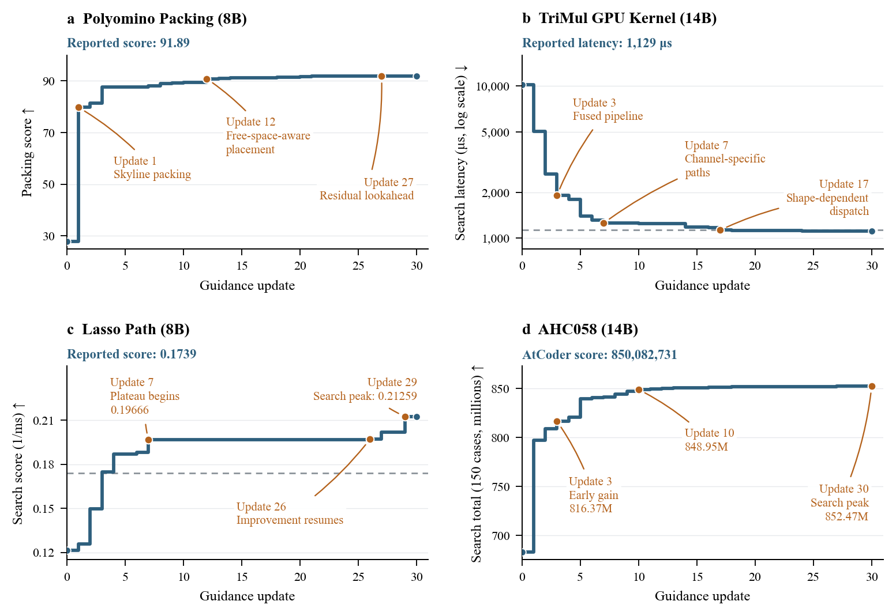

Guidance-TTT: train the guide, keep the executor frozen
=====================================================

Guidance-TTT trains a small model to propose improvements to a candidate
program. A frozen execution model turns each proposal into code. A task judge
evaluates that code, and Reef uses the score to update the guidance model.
Only the guidance response contributes tokens to the training batch.

The example includes Polyomino Packing, Lasso Path, AHC058, and TriMul.
These tasks cover packing, numerical solvers, planning, and GPU kernels.

.. list-table::
   :header-rows: 0

   * - Evolves
     - Guidance-model weights
   * - Signal
     - One finite reward linked to each guidance receipt
   * - Loss family
     - ``tttd``
   * - Package
     - ``recipes/tttd/``
   * - Needs
     - Linux, training GPUs, Docker, a frozen executor, and a task judge
   * - Example
     - ``recipes/tttd/examples/guidance_ttt/``

How one step runs
-----------------

.. flow::
   :loop: use the committed guidance adapter for the next search step

   Select parents :: PUCT selects one archived candidate per group
   Write guidance :: the trainable model reads the problem, summary, and score
   Execute guidance :: the frozen model reads the parent code and proposed change
   Judge candidates :: the task evaluator checks correctness and measures performance
   Report rewards :: each reward references the guidance receipt and grid coordinate
   Update the guide :: the TTTD recipe trains and publishes the guidance LoRA adapter
   Commit the archive :: the controller saves the matching search state

The guidance model sees the parent's canonical summary, not its source code.
The executor sees the source code and the new guidance. It returns a complete
program and a replacement summary for later steps.

Each guidance response must end with one nonempty ``<guidance>`` block.
Malformed guidance receives zero reward without an executor call. The harness
does not resample guidance to repair its format.

The archive admits valid programs and ranks them by the task's raw metric.
The optimizer receives a nonnegative reward. TriMul, for example, minimizes
latency while its training reward is ``1500 / latency_us``.

Choose a task
-------------

.. list-table::
   :header-rows: 1

   * - ``GUIDANCE_TASK``
     - Candidate
     - Judge and metric
   * - ``polyomino_packing``
     - C++17 program
     - FrontierCS problem 0, 70 cases, packing score increases
   * - ``lasso_path``
     - Python wrapper containing C++17 ``CPP_CODE``
     - SimpleTES, 17 cases, inverse geometric-mean solve time increases
   * - ``ahc058``
     - C++20 program
     - TTT-Discover's 150 public cases, mean raw score increases
   * - ``trimul``
     - Python module with Triton kernels
     - 18 correctness tests and seven H100 timing cases, latency decreases

Each task has its own instruction, contract, bootstrap, verifier, scenario,
and state directory. The shared harness uses the same guidance loop for all
four tasks.

Run an example
--------------

Install Reef's GPU dependencies as described in
`Installation <../../getting-started/installation.rst>`__. From the repository
root, install the client and example:

.. code-block:: shell

   git submodule update --init third_party/reef-client
   python -m pip install -e ./third_party/reef-client
   python -m pip install -e . -e recipes/tttd/examples/guidance_ttt
   cd recipes/tttd/examples/guidance_ttt

Select a task and prepare its pinned bootstrap:

.. code-block:: shell

   export GUIDANCE_TASK=lasso_path
   python prepare.py "$GUIDANCE_TASK"

Start its judge using the
`evaluator instructions <../../../recipes/tttd/examples/guidance_ttt/judges/README.md>`__.
Set both judge addresses if you change the default port or host:

.. code-block:: shell

   export GUIDANCE_JUDGE_URL=http://127.0.0.1:8082
   export GUIDANCE_JUDGE_CONTAINER_URL=http://host.docker.internal:8082

The first address is for the host harness. The second is for the final
Harbor verifier inside Docker. Polyomino defaults to port 8081. The other
tasks default to port 8082.

Choose the frozen executor:

.. code-block:: shell

   # A separately served GPT-OSS-120B endpoint:
   export GUIDANCE_EXECUTOR=local
   export GUIDANCE_EXECUTOR_URL=http://127.0.0.1:8000/v1

   # Or GLM-5.2 through OpenRouter:
   export GUIDANCE_EXECUTOR=openrouter
   # Supply OPENROUTER_API_KEY through your environment or credential store.

For a bounded smoke run, set ``GUIDANCE_EXECUTOR_MAX_TOKENS=16384``.
Without this setting, the executor provider selects its default output limit.

Start the example from a GPU allocation:

.. code-block:: shell

   ./run.sh

The default configuration runs one update with two groups of four rollouts.
It downloads Qwen3-8B once, starts Reef, verifies the bootstrap, and runs the
selected Harbor trial. It then submits the best archived program for a final
verification. The final Harbor reward remains evaluation-only.

The default run checks integration. It does not reproduce the paper's
30-update, 8-by-16 search budget. The local executor also differs from the
paper's GLM-5.2 executor.

Configure a search
------------------

``serve.yaml`` owns the grid and training limits. The harness reads the same
file, including a file selected through ``GUIDANCE_CONFIG``.

.. list-table::
   :header-rows: 1

   * - Configuration
     - Default
     - Meaning
   * - ``recipe.config.groups-per-step``
     - 2
     - Parents selected per update
   * - ``recipe.config.rollouts-per-group``
     - 4
     - Guidance samples per parent
   * - ``training.options.global-batch-size``
     - 8
     - Must equal groups times rollouts
   * - ``training.config.steps``
     - 1
     - Total committed updates requested
   * - ``training.config.max_tokens``
     - 8192
     - Maximum guidance response length
   * - ``GUIDANCE_MAX_WORKERS``
     - 8
     - Concurrent executor calls
   * - ``GUIDANCE_MODEL``
     - ``Qwen/Qwen3-8B``
     - Guidance model downloaded by the launcher
   * - ``GUIDANCE_STATE_DIR``
     - ``work/<task>``
     - Absolute root for records, checkpoints, and the archive

For the paper budget, set the grid to 8 by 16, the batch size to 128,
and the update count to 30. AHC058 and TriMul use Qwen3-14B in the main results.
Set ``GUIDANCE_MODEL=Qwen/Qwen3-14B`` for those configurations. Model size,
context length, and concurrency determine the required GPU memory.

Bootstrap verification uses the same evaluator as search. For your own seed,
set ``GUIDANCE_SEED`` to its source file. Place a canonical summary beside it
with the same stem and a ``.md`` extension.

The report contract
-------------------

Each report references the receipt from its guidance inference. Its metadata
contains ``step``, ``group``, ``rollout``, ``groups_per_step``, and
``rollouts_per_group``. The
`TTT-Discover guide <tttd.rst>`__ describes the complete grid contract.

The task judge returns ``score`` for training and ``scoreUnbounded`` for
archive ranking. It also returns ``valid``. An invalid AHC058 program can earn
a partial training reward, but it cannot enter the executable archive.

A missing judge, malformed score, or executor service error stops the step.
These errors do not become zero-reward training examples. A rejected candidate
receives the task's invalid reward and still counts as a PUCT visit.

Four paper results
------------------

The following values come from the paper's main results at commit
``709c405``. They are historical experiment results, not new measurements of
this example. Each configuration uses a frozen GLM-5.2 executor and 30 updates
with eight groups of 16 rollouts.

.. list-table::
   :header-rows: 1

   * - Task
     - Guidance model
     - Reported result
     - Evaluation
   * - Polyomino Packing
     - Qwen3-8B
     - **91.89**
     - 70-case packing score, higher is better
   * - Lasso Path
     - Qwen3-8B
     - **0.1739**
     - Inverse geometric-mean solve time, higher is better
   * - AHC058
     - Qwen3-14B
     - **850,082,731**
     - Submitted solution's AtCoder score, higher is better
   * - TriMul
     - Qwen3-14B
     - **1,129 microseconds**
     - Seven-case H100 geometric-mean latency, lower is better

The lines show the best archived solution during search. Search-time
measurements and final evaluations use different protocols for some tasks.
For Lasso, the search peak is about 0.21259, while the frozen-solver result
is 0.1739. AHC058's search curve uses the 150 public cases. Its reported
AtCoder score comes from the final submission. TriMul's final value comes
from fixed-kernel timing, not the lowest observed search latency.

Polyomino Packing
~~~~~~~~~~~~~~~~~

The final program scores 91.89 against the paper's human reference of 89.10.
CORAL with Opus 4.6 scores 84.20, and TTT-Discover with GPT-OSS-120B scores
83.72. The discovered solver combines skyline packing with reconstruction
and simulated annealing over earlier placements.

Lasso Path
~~~~~~~~~~

The final score is 0.1739 against 0.1243 for SimpleTES and 0.1368 for
TTT-Discover. Both references use GPT-OSS-120B. The solver uses a segment tree
to prioritize candidate correlations and avoid repeated scans over inactive
features. Every accepted solver must meet the reference objective tolerance
of ``1e-6``.

AHC058
~~~~~~

The final AtCoder score is 850,082,731. The paper reports 849,325,750 for
SimpleTES with GPT-OSS-20B and 848,414,228 for TTT-Discover with GPT-OSS-120B.
The discovered policy changes investment phases according to the current
state and values the downstream effects of machine upgrades.

TriMul
~~~~~~

The fixed kernel reaches 1,129 microseconds. The paper lists 1,131 for
K-Search, 1,261.99 for TTT-Discover, and 1,128 for the eligible GPUMode rank-1
reference. Thus, Guidance-TTT does not beat that public rank-1 result.
Its kernel fuses normalization, projection, gating, and layout conversion,
then selects a contraction path by input shape.

These comparisons use the models and budgets of their source experiments.
They are not controlled comparisons with identical model capacity or cost.
The `result records <../../../recipes/tttd/examples/guidance_ttt/results/paper/README.md>`__
include all displayed baseline values, source checksums, and numerical histories.

Inspect progress and resume
---------------------------

Each task writes ``reef.log``, ``guidance-run/``, ``checkpoints/``,
``agent-record/``, and ``lab/`` under its state directory. The controller waits
for the training transaction and adapter publication before it commits the
matching archive.

Restart with the same task, model, executor, grid, configuration, and state
directory. The controller restores ``committed-library.json`` and checks the
stored training identity. A changed task contract or executor configuration
requires a new state directory.

The default checkpoint interval is one version. Checkpoint availability is
separate from archive availability. A saved program alone is insufficient
for a full optimizer resume.

Enable experiment tracking
--------------------------

Set ``observability.wandb.enabled`` to ``true`` in ``serve.yaml``. Supply the
project, optional entity, and credentials through the normal W&B configuration.
`Experiment tracking <../operate.rst>`__ describes Reef's tracking behavior.

The recipe records ``tttd/reward_mean``, ``tttd/reward_max``, and grid metrics.
These rewards describe the training batch. Use the committed archive's raw
score for the best discovered program, especially when the reward is normalized.

Add another task
----------------

Add a directory under ``harbor/`` with an instruction, contract, bootstrap
source, environment, and final verifier. Register its name and timeout in
``harness/config.py``. Implement a judge that returns a finite training reward,
the raw metric, and candidate validity. Add contract and invalid-output tests
before a GPU run.

Related guides
--------------

* `TTT-Discover <tttd.rst>`__: the grouped objective and training transaction.
* `Train model weights <../evolve-your-model.rst>`__: the GPU runtime.
* `Example README <../../../recipes/tttd/examples/guidance_ttt/README.md>`__: evaluator setup and local checks.
