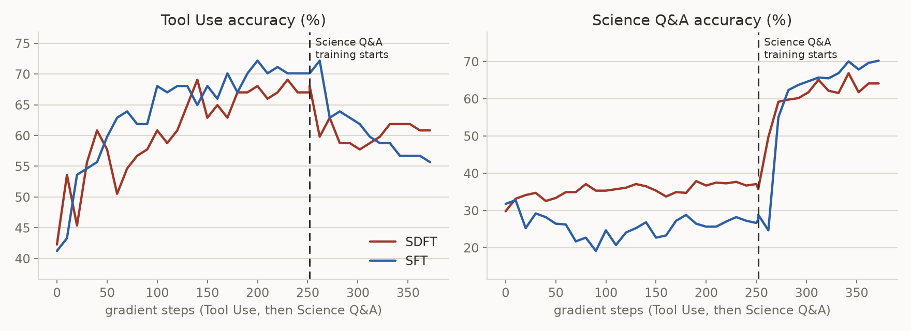

SDFT: learn from demonstrations without forgetting
==================================================

Self-Distillation Fine-Tuning (`arXiv:2601.19897
<https://arxiv.org/abs/2601.19897>`__) learns from demonstrations on policy.
The model that reads a demonstration in its prompt is the teacher. The same
model without the demonstration is the student. The student samples the
response and the loss pulls its next-token distributions toward the
teacher's. The paper reports higher new-task accuracy and less forgetting
than supervised fine-tuning on the same demonstrations.

+-------------+------------------------------------------------------------+
| Evolves     | model weights                                              |
+-------------+------------------------------------------------------------+
| Signal      | one report with the demonstration as ``teacher_context``   |
|             | per rollout                                                |
+-------------+------------------------------------------------------------+
| Loss family | ``sdft``                                                   |
+-------------+------------------------------------------------------------+
| Package     | ``recipes/sdft/``                                          |
+-------------+------------------------------------------------------------+
| Processor   | reported feedback, singleton                               |
+-------------+------------------------------------------------------------+
| Needs       | GPUs, and a backend that captures tokens and log-probs     |
+-------------+------------------------------------------------------------+
| Example     | `SDFT on a skill stream                                    |
|             | <../../../recipes/sdft/examples/skill_stream/README.md>`__ |
+-------------+------------------------------------------------------------+

What it does
------------

The harness sends a request through Reef. It gets a demonstration of the
response from somewhere else such as a reference solution or a stronger
model. It reports the demonstration against the request's receipt. With the
default ``batch_size`` of 1 each report is one training step.

.. flow::
   :loop: the next request is served by the updated weights

   Rollout :: the student answers a request
   Demonstration :: a reference response for the same request
   Report :: the demonstration as ``teacher_context`` against the rollout's receipt
   Step* :: distil the demonstration-conditioned teacher on the student's own tokens
   Version :: publish the updated weights to the engine

How Reef implements it
----------------------

The processor is the shared ``DistillProcessor``
(`Processors <../../developer-guide/processors.rst>`__). It turns every
``TeacherContextReport`` into one ``TrajectoryItem``. The item carries the
student's recorded tokens and ``teacher_tokens``. ``teacher_tokens`` is the
teacher's request rendered with the served model's chat template and
followed by the student's response ids.

SDFT's processor adds the demonstration block to the request's final user
message. It adds the block as a new user message when the request ends in a
tool result. ``context_template`` sets the block's text and its default is
the reference implementation's wording. A harness that needs another layout
subclasses the processor and overrides ``teacher_request``.

The ``sdft`` loss family is a thin family on the Slime backend's
distillation base in ``reef/train/slime_backend/distill/``
(`Loss families <../../developer-guide/loss-families.rst>`__). It sets the
reference's defaults and runs as a ``custom_loss``. Before each step the base
runs one forward pass over every sample's teacher sequence and keeps the
teacher's next-token distribution at each response position. The loss
compares the student's distribution at the same positions with it.

The teacher is the model itself (``--sdft-teacher self``) and
``--sdft-teacher-update-rate`` sets how its weights move. The default is
0.01. The teacher starts as a copy of the initial weights and moves 1% toward
the policy after every step. A rate of 1 makes
the current policy the teacher and a rate of 0 freezes the initial weights.
In the skill stream example a teacher that follows the policy drifted with
it and training collapsed. The example freezes the teacher with a rate of 0.

The loss is the per-token divergence over the full vocabulary. The forward
KL is the default and the reverse KL and the generalized JSD are switches. A
top-K representation of the teacher is another switch. Each sample
contributes the mean over its trained response tokens. That mean is weighted
by the truncated importance-sampling ratio between the policy and the
rollout engine's log-probs.

The report contract
-------------------

A report references one inference record and carries the demonstration as
``metadata.teacher_context``. A ``score`` is optional metadata and the
recipe never trains on it.

.. code:: json

   {
     "references": ["<receipt of the student's request>"],
     "metadata": {"teacher_context": "<the demonstration>"}
   }

Configuration
-------------

.. config::

   batch_size | 1 | rollouts per optimizer step. Must equal the driver's ``--global-batch-size`` because each sample is its own data-parallel unit.
   tokenizer_path | required | the served model's tokenizer directory. It renders the teacher prompt with the engine's chat template.
   max_teacher_tokens | 0 | a report with a longer teacher sequence is skipped and counted in ``teacher_overflow_reports``. 0 disables the check. Set it to the trainer's window.
   context_template | the reference's block | the text added to the final user message. ``{context}`` marks where the demonstration goes.
   max_staleness | 0 | accepted lag between the producing and serving version.

The Slime driver takes ``--loss-type custom_loss`` and
``--use-rollout-logprobs`` and ``--disable-compute-advantages-and-returns``.
The family adds its own flags:

.. config::

   --sdft-teacher | self | who scores the samples. ``self`` is the model itself reading the demonstration. ``separate`` is another checkpoint of the same architecture set by ``--sdft-teacher-checkpoint``.
   --sdft-divergence | forward | ``forward`` is KL(teacher || student). ``reverse`` is KL(student || teacher). ``jsd`` is the generalized Jensen-Shannon divergence and ``--sdft-jsd-beta`` sets the teacher's mixture weight with a default of 0.5.
   --sdft-top-k | 0 | keep the teacher's top-K log-probs and its log-prob at the sampled token. 0 keeps the whole distribution.
   --sdft-teacher-update-rate | 0.01 | fraction of the current policy mixed into the teacher's weights after every step. 1 makes the current policy the teacher and 0 freezes the initial weights.
   --sdft-importance-sampling-cap | 2.0 | cap of the truncated importance-sampling weight. 0 disables the correction.
   --sdft-skip-response-tokens | 0 | response tokens at the start of every sample left out of the loss. The paper's runs used 3.

The teacher pass keeps one float16 block per sample on the host between the
pass and the step. The block has one row per response token and one column
per vocabulary entry on the rank. That is about 2 GB for a 16k-token
response of a 248k-vocabulary model at tensor parallel 4. Size
``max_teacher_tokens`` with that in mind for long contexts. A moving teacher
copy also costs the actor's weights once more on the host per rank.

Run the example
---------------

The `example <../../../recipes/sdft/examples/skill_stream>`__ trains one
model on Tool Use and then on Science Q&A on a four-GPU stack. A judge scores
both skills every ten steps during both stages. The example's README
describes the protocol and the settings.

.. code:: bash

   cd recipes/sdft/examples/skill_stream
   hf download Qwen/Qwen2.5-7B-Instruct --local-dir ~/models/Qwen2.5-7B-Instruct
   ./run.sh

Results
-------

The figure shows one run of SDFT and one run of an SFT control on
Qwen2.5-7B-Instruct.

Tool Use training comes first and both methods learn it to about the same
level. SFT pushes Science Q&A below the base model and SDFT does not.

Science Q&A training comes second and both methods learn the new skill. SDFT
forgets only a little Tool Use and SFT forgets much more.

Related guides
--------------

- `Inference and feedback quickstart <../../getting-started/quickstart.rst>`__:
  learn the request, receipt, and report workflow.
- `Train model weights from agent feedback <../evolve-your-model.rst>`__:
  set up the GPU stack and inspect published updates.
- `Loss families <../../developer-guide/loss-families.rst>`__: how a family
  such as ``sdft`` plugs into the Slime backend, and the distillation base
  it is built on.
