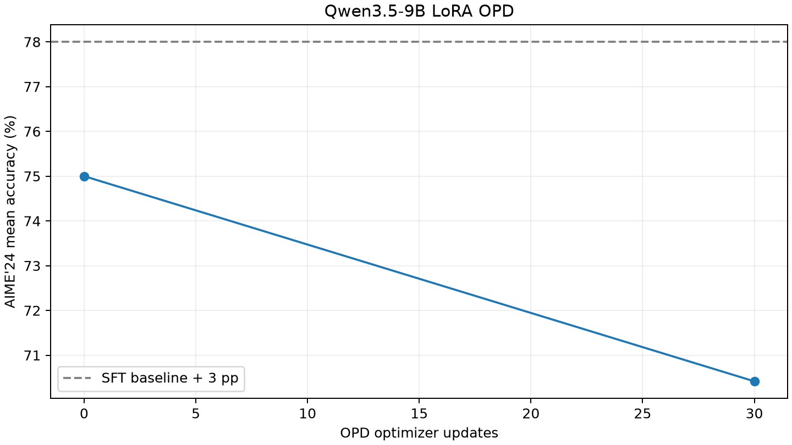

# OPD on mathematical reasoning

This example distils `Qwen/Qwen3.5-9B` into `Qwen/Qwen3.5-9B-Base` after
OpenThoughts3 SFT and evaluates on AIME'24. It targets roadmap
[#502](https://github.com/Human-Agent-Society/reef/issues/502); the experiment
is tracked in [#682](https://github.com/Human-Agent-Society/reef/issues/682).
The model pair follows the cookbook at `dfe4d77e8e8c`; the original 2025
write-up used Qwen3-8B and reported AIME'24 moving from about 60% to 70%.

Everything runs on local GPU workers through Reef, Slime/Megatron and SGLang.
`prepare.py` pins the datasets, `sft.py` trains the initialization, `run.py`
drives sampling, reporting and evaluation against a live `reef serve`, and
`analyze.py` plots the curve. The scripts form a direct `reef_client` campaign
and need neither Harbor nor reef-eval.

## Results



One LoRA run of 30 updates on four B200 GPUs (2026-09-30): frozen
Qwen3.5-9B-Base with a rank/alpha 32 adapter trained for one epoch on 4096
OpenThoughts3 math examples, then 30 OPD updates of 64 DeepMath prompts by
four responses each. Training responses were capped at 4096 tokens and the
evaluation at 32768 output tokens, over 30 questions by 16 seeds.

| Checkpoint | Correct / samples | Mean accuracy | Responses at the output limit |
| --- | --- | --- | --- |
| Frozen Qwen3.5-9B teacher, 64000-token budget | 406 / 480 | 84.6% | 63 |
| LoRA SFT, OPD step 0 | 360 / 480 | 75.0% | 92 |
| OPD step 30 | 338 / 480 | 70.4% | 101 |

The change is −4.6 percentage points with a paired question-bootstrap 95%
interval of [−13.3, +3.3] points, so the run shows neither an improvement nor
a clear degradation. The budgets explain most of it. The student's median
response was already 14.6k tokens before OPD, so the 4096-token training cap
gave it the teacher's signal only on the start of its reasoning, and the
responses that grew under OPD ran into the 32768-token evaluation limit: 51 of
the 62 answers lost were newly cut off. The configurations below use the
16384-token training and 64000-token evaluation budgets of the full-parameter
protocol, and a rerun under them is pending. The full-parameter SFT
initialization was stopped at step 1239 of 3000, so its OPD run never started.

## Protocol

- Student base: `Qwen/Qwen3.5-9B-Base`, revision `68c46c4b3498877f3ef123c856ecfde50c39f404`.
- Frozen teacher: `Qwen/Qwen3.5-9B`, revision `c202236235762e1c871ad0ccb60c8ee5ba337b9a`.
- Initialization: 384,000 OpenThoughts3 examples, one pass, batch 128, 3,000
  steps, 16,384-token sequences, full language-model SFT at learning rate 1e-4
  with linear decay; the unused vision encoder is frozen. A published
  compatible SFT checkpoint with documented data and settings is preferable
  when one exists.
- OPD: DeepMath prompts in dataset order, truncated to 1,024 prompt tokens as
  in the reference; 512 prompts by four responses per optimizer update, 200
  updates, learning rate 5e-5, temperature 1, response limit 16,384. The
  teacher reads the exact student sequence and stays frozen. No answer labels,
  correctness rewards or teacher-only context are used.
- Evaluation: the 30 AIME'24 questions, 16 samples per question at seeds 0
  through 15, temperature 1, top-p 1, top-k disabled, a 64,000-output-token
  budget and the same boxed-answer instruction and scorer for every checkpoint,
  at initialization, every 20 updates and at update 200. The metric is mean
  accuracy over the 16 samples, not pass@16. Evaluation receipts are never
  reported for training. SGLang deterministic inference is enabled because the
  pinned runtime otherwise ignores per-request seeds.
- Target: the final scheduled checkpoint improves mean AIME'24 accuracy over
  the SFT initialization by about ten points (`--target-improvement 0.10`).
  Report the whole curve with its uncertainty, a missed target included, and
  do not pick the best test-set checkpoint.

## Environment

Use the repository's Slime GPU image (`docker/README.md`). The example uses
four GPUs: a TP4 actor and four TP1 rollout engines colocated on them. The
teacher pass loads the frozen weights into the actor and restores the student
afterwards. Mount model, data and output storage at `/work` with room for the
base, the teacher, the SFT checkpoint and two optimizer checkpoints. The
configuration caps OPD checkpoint storage at 600 GB and reserves 100 GB of
free space; a measured optimizer plus HF checkpoint pair took about 188 GiB,
and the cap must hold the protected current checkpoint plus the next
reservation. Ports and state directories must belong to this experiment.

The B200 runs used
`slimerl/slime@sha256:8851cdff296ce6e569fed9b427aab05a72b55e803ccf73ecb6697c261621fd02`
with the repository's Slime and SGLang pins, torch 2.11.0+cu129, Transformers
5.12.1, tokenizers 0.22.2 and Megatron Bridge 0.4.2. The scripts need the
packages in this example's `pyproject.toml`. The SFT initializer also needs
`flash-linear-attention==0.4.2`, `fla-core==0.4.2` and `causal-conv1d==1.7.0`
built for that CUDA/PyTorch, and refuses to run on Transformers' slow Gated
DeltaNet fallback. Install them in the GPU environment without replacing its
torch:

```bash
uv pip install --no-deps flash-linear-attention==0.4.2 fla-core==0.4.2
uv pip install --no-deps --no-build-isolation causal-conv1d==1.7.0
```

## Data

```bash
hf download Qwen/Qwen3.5-9B-Base --revision 68c46c4b3498877f3ef123c856ecfde50c39f404 --local-dir /work/models/Qwen3.5-9B-Base
hf download Qwen/Qwen3.5-9B --revision c202236235762e1c871ad0ccb60c8ee5ba337b9a --local-dir /work/models/Qwen3.5-9B
python recipes/opd/examples/math/prepare.py --output /work/data --tokenizer /work/models/Qwen3.5-9B
```

`prepare.py` pins the three datasets, writes `deepmath.jsonl`, `aime24.jsonl`
and `sft.jsonl` with their checksums in `manifest.json`, and refuses to
overwrite an existing output. Its SFT shuffle uses the reference's
384,000-example buffer and takes significant host memory.

## SFT initialization

```bash
python recipes/opd/examples/math/sft.py --tokenize-only --data /work/data/sft.jsonl --tokenized /work/sft-data --output /work/sft
torchrun --standalone --nproc-per-node=4 recipes/opd/examples/math/sft.py --data /work/data/sft.jsonl --tokenized /work/sft-data --output /work/sft
```

The initializer masks the prompt, keeps reasoning tokens and appends no EOS to
a truncated response. It keeps the latest optimizer checkpoint for `--resume
/work/sft/checkpoint-N` and exports the final Hugging Face checkpoint to
`/work/sft/final` with the teacher's tokenizer, whose vocabulary the student
shares.

## OPD and evaluation

Start the service with a fresh run directory and a private token:

```bash
export OPD_MODEL_PATH=/work/sft/final
export OPD_TEACHER_PATH=/work/models/Qwen3.5-9B
export OPD_RUN_DIR=/work/opd
mkdir -p "$OPD_RUN_DIR"
export REEF_TOKEN="$(openssl rand -hex 24)"
reef serve -c recipes/opd/examples/math/serve.yaml
```

In another terminal with the same `REEF_TOKEN`, once `/healthz` answers:

```bash
python recipes/opd/examples/math/run.py --config recipes/opd/examples/math/serve.yaml \
  --train-data /work/data/deepmath.jsonl --eval-data /work/data/aime24.jsonl --output /work/opd/results
```

The driver collects a complete batch before submitting any training report,
checks that every response came from one release, then waits for exactly one
committed update. Its `--prompts-per-step` times `--samples-per-prompt` must
equal the recipe's `batch-size`. It refuses an existing output directory or
scenario unless `--resume` is given.

`--resume` recovers an interrupted driver process against the same live
service, scenario and output directory. Completed responses are reused, only
the missing samples of the current release are regenerated, and report ids are
deterministic, so a retry after a lost HTTP response does not enqueue a
duplicate update. Recovery checks the input, configuration and driver
checksums, the sampling settings, the release history and each commit's exact
consumed receipts; it refuses missing historical predictions, unrelated
updates, rollbacks and pending publications, and only one driver may own an
output directory. Network timeout and concurrency may change on resume, the
statistical protocol may not. Resume does not restore a stopped trainer or its
optimizer: if the service or GPU runtime fails, inspect its checkpoint and
recovery state before continuing, and never restart from baseline weights and
call it a resumed model.

`--steps 0` on a separately launched frozen SFT or teacher deployment gives a
control evaluation under the same data, seeds, budget, prompt and scorer. For
a smoke run, copy the YAML and reduce the recipe's `batch-size` together with
`--prompts-per-step`, `--samples-per-prompt` and the token budgets, and label
the result an integration check.

## LoRA variant

`serve.lora-small.yaml` freezes the base and trains a rank/alpha 32 adapter on
the language-model MLP down and attention output projections, starting from a
PEFT SFT adapter through `--megatron-lora-init`. `prepare_small.py` selects a
small SFT subset: 4096 OpenThoughts3 math demonstrations from seed-0 shuffled
shards (a shard subset, not a uniform sample of the dataset), deduplicated,
with exact-match AIME questions excluded (not a paraphrase audit) and truncated
to 8192 tokens without an invented EOS, plus 1920 DeepMath prompts disjoint
from them.

```bash
python recipes/opd/examples/math/prepare_small.py --random-truncate --source /work/data --output /work/lora-small/data
torchrun --standalone --nproc-per-node=4 recipes/opd/examples/math/sft.py \
  --data /work/lora-small/data/sft.jsonl --tokenized /work/lora-small/data/tokenized \
  --output /work/lora-small/sft --steps 128 --global-batch-size 32 \
  --max-length 8192 --save-steps 64 --lora-rank 32 --lora-alpha 32
```

Point `OPD_MODEL_PATH` at the unchanged base weights, `OPD_ADAPTER_PATH` at
the SFT `final` adapter, `OPD_TEACHER_PATH` at the teacher and `OPD_RUN_DIR` at
a fresh directory, export `REEF_TOKEN`, then:

```bash
reef serve -c recipes/opd/examples/math/serve.lora-small.yaml
python recipes/opd/examples/math/run.py \
  --config recipes/opd/examples/math/serve.lora-small.yaml \
  --url http://127.0.0.1:28994 --scenario opd-lora-small \
  --train-data /work/lora-small/data/deepmath.jsonl \
  --eval-data /work/lora-small/data/aime24.jsonl --output /work/lora-small/results \
  --steps 30 --prompts-per-step 64 --samples-per-prompt 4 \
  --train-tokens 16384 --eval-tokens 64000 --eval-repeats 16 --eval-every 30 --concurrency 64
python recipes/opd/examples/math/analyze.py /work/lora-small/results \
  --final-step 30 --eval-every 30 --target-improvement 0.03 --training-mode LoRA
```

The importer validates all 80 adapter tensors and splits the row-parallel ones
across TP4 before the optimizer is created; only these unfused Qwen3.5
projections and pipeline parallel size one are supported. The frozen teacher
pass clears the student adapter before backing up its weights. The operational
target of this smaller protocol is three points.

## Output and analysis

`config.json` and `inputs.json` record the driver settings and input
checksums; `train-*.jsonl` and `eval-*.jsonl` record responses, receipts,
release ids, seeds, finish reasons and usage; `metrics.jsonl` records accuracy
and truncations per evaluated step; `releases-*.json` and `commit-*.json`
record the publication history and the exact records each update consumed.
Keep the service logs and the resolved stack configuration beside them, and
name the SFT checkpoint and image digest in any report.

After the final scheduled evaluation:

```bash
python recipes/opd/examples/math/analyze.py /work/opd/results
```

The analysis needs the same question/seed pairs at every checkpoint and every
scheduled evaluation including the final step; pass matching `--final-step`
and `--eval-every` for another schedule. It writes `acceptance.json` with the
final improvement, whether it reaches the target, and a 95% bootstrap interval
that resamples whole questions while keeping their repeats and the
baseline/final pairing, plus `learning_curve.png` over every evaluated
checkpoint. The scorer accepts the final boxed integer, including
`\boxed{\text{42}}`, and does not convert symbolic equivalents.
