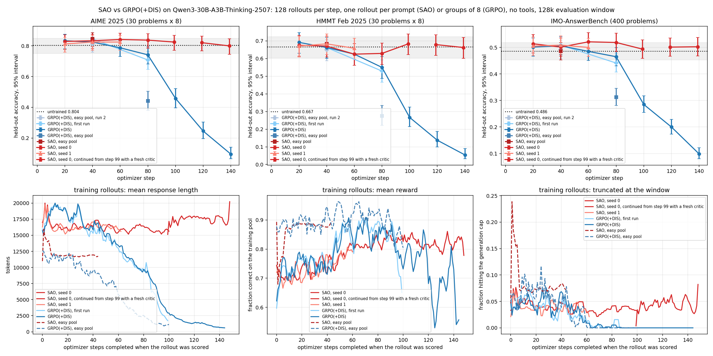

# SAO on Reef

This example implements the harness side of
[Single-Rollout Asynchronous Optimization](https://arxiv.org/abs/2607.07508).
SAO samples one rollout per prompt and grades each on its own. There is no
comparison group and no barrier: a scored rollout joins the next optimizer
step without waiting for siblings, and the next request is served by the
updated weights. The method itself is the `sao`
recipe package (`recipes/sao/`). This directory holds the loop around it: three
IMOAnswerBench problems as Harbor tasks, a Harbor agent that runs six scored
rollouts per problem through Reef, and `run.py`, which runs the tasks in order.

The [`sao` recipe page](../../../../docs/user-guide/recipes/sao.rst) documents
the recipe's configuration and runtime metrics, and
[Evolve your model](../../../../docs/user-guide/evolve-your-model.rst) walks
through the training stack this example starts. This README records the
example's implementation details, its distance from the paper's protocol, and
a completed comparison against GRPO at the paper's model scale.

```text
harbor/               three IMOAnswerBench problems as Harbor tasks, run in order by run.py
  imo-4/                problem_idx 4 (gold: 2^{u-2})
  imo-8/                problem_idx 8 (gold: -2023/2024^2)
  imo-12/               problem_idx 12 (gold: 1/2)
    task.toml             metadata, timeouts, resource limits
    instruction.md        the problem text and the \boxed{} instruction
    environment/          the Python image the verifier runs in
    tests/
      test.sh             runs the verifier
      grade.py            extracts \boxed{}, checks it against the gold answer
harness/              agent harness (imports reef_client, not reef)
  __init__.py           lazily exports HarborAgent
  agent.py              HarborAgent: six scored rollouts per problem, one report each
  grader.py             \boxed{} extraction and the strict equivalence rule, shared with stream.py and evaluate.py
  report.py             posts Harbor's verifier reward against the trial's receipts
serve.yaml            smoke stack config (batch 1): Reef + Ray + Slime/Megatron + SGLang, critic colocated
serve-30b.yaml        Qwen3-30B-A3B-Thinking-2507 on one 8-GPU node, fed by stream.py
serve-30b-multi.yaml  the same model with data-parallel training nodes and separate rollout engines, batch 128
serve-30b-grpo.yaml   GRPO(+DIS) control on one node
serve-30b-grpo-multi.yaml  GRPO(+DIS) control at batch 128
run.py                the loop, written out: solve, verify, report, task by task
run.sh                starts the Reef training stack, then runs run.py or SAO_DRIVER
stream.py             the paper-shaped streaming driver: one rollout per prompt, many prompts in flight
export_problems.py    writes the problems JSONL that stream.py and evaluate.py read
evaluate.py           held-out evaluation of a served model with the training grader
plot_stream.py        training reward and held-out accuracy of one streaming run
plot_paper.py         held-out accuracy and training dynamics against optimizer step (the Results figure)
plot_curve.py         held-out accuracy per checkpoint, one panel per benchmark
pyproject.toml        makes the harness importable
results/              held-out accuracy and training curves of the batch-128 comparison
```

## The harness

`HarborAgent` receives one problem per Harbor trial as its `instruction`,
looks up the gold answer, and runs `ROLLOUTS` (six) attempts at it. Each
attempt is one chat request at `temperature=1.0, top_p=1.0` with a
2048-token generation window. The agent extracts the last `\boxed{}` from the
completion and compares it with the gold answer under the strict equivalence
rule the Harbor verifier uses: an exact match after whitespace and `$` are
stripped, or a numeric evaluation of simple LaTeX (fractions, roots, π) within
a relative tolerance of `1e-6`. The reward is binary, 1.0 for a correct answer
and 0.0 otherwise. The rule is copied into `harness/grader.py` rather than
imported from the task, because the harness is installed on its own into
reef-eval's environment; `stream.py` and `evaluate.py` grade with the same
module.

The last completion is written to `/workspace/answer.txt`, where the Harbor
verifier (`harbor/imo-*/tests/grade.py`) scores it independently and records
the trial's reward.

## The changes needed for Reef

The rollout loop in `HarborAgent.run` contains the two integration points:

```python
response, agent_record_id = await asyncio.to_thread(self._ask_reef, instruction)
completion = response["choices"][0]["message"]["content"]
predicted = extract_answer(completion)
score = 1.0 if answers_equal(gold, predicted) else 0.0
self._client.report(SCENARIO, {"score": score, "references": [agent_record_id]}, recipe=RECIPE)
```

1. Send inference through a scenario-scoped Reef endpoint
   (`inference_with_record`) and keep the returned `agent_record_id` as the
   generation receipt.
2. After the local grader computes the reward, report it against that exact
   receipt. The dispatcher collects `batch_size` reports into one training
   step; this smoke config sets `batch_size: 1`, so each report is one step.

A third piece runs after the trial. Harbor writes `result.json` when the
verifier finishes, and a watcher thread posts the verifier's reward as one
more report, referencing all six receipts (`harness/report.py`; the report id
is derived from the trial id, so a repeated post changes nothing). That report
does not train, because its references have already trained and the `sao`
recipe does not accept multi-reference samples. It records the trial's verdict
against the same receipts.

The runtime flow is:

```text
reef-eval starts one Harbor trial for the next problem
  -> the agent sends one OpenAI-compatible chat request through Reef
  -> the SGLang backend renders the prompt once and calls /generate
  -> Reef stores the sampled tokens, the loss mask, and the rollout log-probabilities
  -> the agent extracts \boxed{} and scores it against the gold answer
  -> the agent reports the score against that rollout's receipt
  -> SAOProcessor accepts the report and emits one ATIF TrajectoryItem
  -> the sao training objective hands Slime a batch of one
  -> the colocated critic computes values; skip-observation GAE builds the advantages
  -> Slime runs policy_loss with SAO's per-token DIS primitive, after two critic steps
  -> Megatron performs one optimizer step and synchronizes weights to SGLang
  -> the next rollout is served by the updated weights
```

## Included paper problems

The three tasks are IMOAnswerBench (`Hwilner/imo-answerbench`) problems
`problem_idx` 4, 8, and 12, the slice the paper-scale run below used. They
were chosen because the untrained model neither always solves nor always
fails them under the strict grader, so the rewards carry a signal. Each
`instruction.md` is the problem text followed by the instruction to put the
final answer in `\boxed{}`. The verifier applies the same extraction and
equivalence rule as the agent to `/workspace/answer.txt`. No LLM judge is
involved anywhere in the loop.

## Setup (once)

The training stack needs the GPU environment described in
[Evolve your model](../../../../docs/user-guide/evolve-your-model.rst): Ray,
the Slime driver, and CUDA builds of torch, SGLang, and Megatron. Inside it,
from this directory:

```bash
pip install -e .
hf download Qwen/Qwen2.5-1.5B-Instruct --local-dir ~/models/Qwen2.5-1.5B-Instruct
```

`run.py` also needs `docker`: Harbor runs each task's verifier in its own
container. The `docker run` line in Evolve your model does not provide that,
so when the stack itself runs inside the reef image, extend it:

```bash
docker run --gpus all --network host --ipc host --shm-size 32g -it \
  -v ~/models:/root/models \
  -v /var/run/docker.sock:/var/run/docker.sock \
  -v "$REPO":"$REPO" -w "$REPO" \
  reef bash
# inside: apt-get update && apt-get install -y docker.io
```

Mount the repo at its host path (`-v "$REPO":"$REPO"`, not `/workspace/Reef`):
Harbor's sibling containers bind-mount trial directories by path, and those
paths must mean the same thing to the host docker daemon.

## Run

```bash
./run.sh
```

The launcher waits for Reef's health endpoint and stops waiting if Reef
exits. Configure bridge startup with `training.ready-timeout` and HTTP startup
with `reef.ready-timeout` in `serve.yaml`; startup errors are in `work/reef.log`. Exiting or interrupting
the script also stops its Reef process.

`run.sh` starts `reef serve -c serve.yaml` with its state under `./work`,
waits for `/healthz`, and runs `run.py`. `serve.yaml` describes a two-GPU
stack: one Megatron actor with the critic colocated on it, and one SGLang
rollout engine, serving `Qwen2.5-1.5B-Instruct`. On the first start Reef
loads the Hugging Face weights directly and writes the Megatron checkpoint
that later starts load. Ray, Slime, Megatron, and SGLang take minutes to come
up; `work/reef.log` has the service log if startup fails.

The config omits `services`: Reef assembles the Slime driver and HTTP process,
waits for the training bridge, and connects HTTP to the bridge's SGLang workers.
The native training adapter captures rollout log-probabilities directly from the
engine for SAO; no separate inference process or manual bridge wiring is needed.
`training.options` still holds the model and algorithm settings. CLI overrides
use the same paths, for example `--training.options.lr 0.000002`.

Reef starts and stops the shared Ray runtime automatically; no `ray start`
or fixed Ray port is needed. `run.sh` defaults the local cluster's GPU pool to
`CUDA_VISIBLE_DEVICES=0,1`; override it at launch to choose different GPUs.
To use an existing cluster, set `RAY_ADDRESS`; that cluster's node configuration
controls GPU visibility, and Reef leaves it running on exit. Slime allocates
the model GPUs; the local driver does not reserve them a second time.

`run.py` is the loop, written out. For each task in order, reef-eval's `Lab.run`
executes one episode: the agent runs its six rollouts, reporting each one as
it is scored, then Harbor's verifier scores the last completion. The ordering
is the experiment: task `N+1` is served by the weights task `N` produced.

Nothing has to be exported. The service URL, token, scenario, rollout count,
and generation window are constants at the top of `harness/agent.py`, and
the port and token they use are the ones written in `serve.yaml`. The task
list is `TASKS` in `run.py`.

### Reading the release chain and the metrics

Each scored rollout publishes one `training` entry to the scenario's version
chain:

```bash
curl -s -H "Authorization: Bearer reef-local" \
    http://127.0.0.1:8900/reef/scenarios/sao-smoke/releases
```

The runtime reports `pg_clipfrac` (the fraction of tokens the DIS mask
removed), `train_rollout_logprob_abs_diff` (the mean per-token gap between the
engine's and the trainer's log-probabilities, the quantity DIS masks on),
`critic/explained_variance` (meaningful only with more than one sample per
step), actor and critic `grad_norm`, and the asynchrony telemetry `sao/policy_lag_*`, `sao/queue_age_s_*`, and
`sao/effective_token_rate`. Set `observability.wandb.enabled: true` in
`serve.yaml` and export `WANDB_API_KEY` to keep them per committed step;
`observability.wandb.directory` is where the run files go.

### A larger model

Change `inference.model-path`, the GPU counts and parallelism flags, and
`--seq-length` and `--rollout-max-response-len` in `serve.yaml`. The
objective flags are the paper's reasoning-domain values and do not change
with model size. `recipe.config.batch-size` and `training.config.global_batch_size` must stay
equal, because each rollout sample is its own data-parallel unit.

## Paper fidelity

The integration reproduces:

- single-rollout sampling, one rollout per prompt with no comparison group and
  no slowest-sample barrier, with `batch_size` such rollouts per optimizer
  step (the recipe default is the paper's 128; this smoke config sets
  `batch_size: 1`, `--global-batch-size=1`, see below);
- a value model colocated with the actor and two critic steps per actor step
  (`--critic-steps-per-actor=2`), trained at the paper's value learning rate
  of `5e-6` (`--critic-lr=5e-6`) with the paper's 10-step value warmup
  (`--num-critic-only-steps=10`: the first ten optimizer steps fit the
  zero-initialized value head before any policy update);
- value targets from Monte-Carlo returns (λ = 1) and policy advantages from
  the length-adaptive λ with α = 1.5, built by skip-observation GAE in the
  training backend, so the Reef payload carries no advantages;
- the DIS per-token loss with the reasoning-domain mask bounds 0.3 and 5.0,
  computed against the engine's rollout log-probabilities
  (`--use-rollout-logprobs`), which is why the deployment selects Reef's
  token-native SGLang chat backend;
- sampling at `temperature=1.0, top_p=1.0`, a constant policy learning rate
  of `1e-6`, and no entropy bonus.

### Batch size is not group size

The paper trains with "a batch size of 128, a group size of 1" (§4.1): one
rollout per prompt, 128 prompts per optimizer step. Single-rollout is a
statement about the group, not about the step. `run.py` and `serve.yaml` set
`batch_size: 1` and `--global-batch-size=1`, which is a different estimator:
each optimizer step is one REINFORCE sample with a critic baseline. That is
the smallest instance of the paper's loop and a good smoke test, but the gradient of one rollout at the
paper's learning rate is mostly noise, and two of its diagnostics are
degenerate at that size: `critic/explained_variance` is
`1 - Var(R - V) / Var(R)` over the batch, which is identically 0 for one
sample, and the per-step reward is a coin flip. The streaming protocol below
uses the paper's shape at a budget one node can afford.

### The streaming protocol

`stream.py` keeps `SAO_IN_FLIGHT` requests open at all times, each on a
problem drawn from a training pool, grades each completion with the
verifier's rule and reports it against its receipt; `serve-30b.yaml` takes
the optimizer step size from `SAO_BATCH` (the recipe's `batch-size` and the
driver's `--global-batch-size`, which must agree). Held-out problem indices
are never served, and `evaluate.py` scores the base and the trained weights
on them afterwards with fresh samples. `SAO_GROUP=8` turns the same driver
into the GRPO control: eight rollouts of one prompt per step, scored before
the step, which is the barrier SAO removes.

```bash
python export_problems.py work/imo_answerbench.jsonl          # problem_idx, problem, gold
SAO_BATCH=8 SAO_SERVE_YAML=serve-30b.yaml SAO_DRIVER=stream.py \
SAO_PROBLEMS=work/imo_answerbench.jsonl SAO_HOLDOUT=0,1,7,... SAO_POOL=2,5,... \
SAO_IN_FLIGHT=8 SAO_BUDGET=320 ./run.sh
python evaluate.py --problems work/imo_answerbench.jsonl --indices 0,1,7,... --runs 8 \
    --url http://127.0.0.1:30001/v1/chat/completions --label sao --out work/eval-sao.jsonl
python plot_stream.py results/curve.png --records work/records/stream-*.jsonl \
    --eval base=work/eval-base.jsonl sao=work/eval-sao.jsonl --batch 8
```

The host-side scripts need `aiohttp`, `datasets` and `matplotlib`; install
them with `pip install -e ".[stream]"` from this directory.

The batch-128 runs in Results use `serve-30b-multi.yaml` (SAO) and
`serve-30b-grpo-multi.yaml` (the control) on an existing Ray cluster
(`RAY_ADDRESS`): `SAO_TRAIN_NODES` 8-GPU nodes host the actor, tensor
parallel 8 per node and data parallel across nodes with the critic colocated,
and `SAO_ROLLOUT_GPUS` GPUs on other nodes host the engines, tensor parallel
4 each. The runs kept `SAO_CKPT_DIR` on shared storage with the retention
cap set in the stack file, so Reef's coordinator sees the exports it verifies
from whichever node it lands on. `SAO_PROGRESS_FILE`
paces the driver on the trainer: write the number of completed optimizer
steps into it from a host that sees `SAO_CKPT_DIR`, for example the highest
exported step, `ls "$SAO_CKPT_DIR/hf" | sort -n | tail -1`. The control keeps
the same topology and adds `SAO_GROUP=8`, so a step of `SAO_BATCH=128`
rollouts is 16 complete groups. The problems JSONL has the same columns as
`export_problems.py` writes, here filled from the DeepMath pools described
in Results.

```bash
export RAY_ADDRESS=<head>:6379 SAO_TRAIN_NODES=4 SAO_ROLLOUT_GPUS=<engine GPUs> SAO_CKPT_DIR=<shared dir>
SAO_BATCH=128 SAO_IN_FLIGHT=256 SAO_SERVE_YAML=serve-30b-multi.yaml SAO_DRIVER=stream.py \
SAO_PROBLEMS=work/deepmath.jsonl SAO_PROGRESS_FILE=work/progress SAO_BUDGET=12800 ./run.sh
SAO_GROUP=8 SAO_SERVE_YAML=serve-30b-grpo-multi.yaml ... ./run.sh   # the GRPO(+DIS) control
```

The cookbook configuration is a functional smoke rather than the paper's
setup: it serves Qwen2.5-1.5B-Instruct with a 2048-token generation window,
trains on the benchmark's own problems, starts from the public
instruction-tuned checkpoint, and runs one optimizer step per rollout
(`batch_size: 1`). That last point matters more than the model size. The paper
trains with a batch of 128 rollouts from 128 prompts per step (§4.1); "single
rollout" refers to one rollout per prompt, not one rollout per update. A batch
of one gives the critic a single sample per step, so it cannot learn a
baseline and the advantages it feeds the policy are noise; the paper's
argument for single-rollout training rests on the value model doing that
job. Use the recipe default (128, or `SAO_BATCH` in the paper-scale configs)
for any run whose numbers are meant to be read. The runs in Results use the paper's
model and batch shape and list their remaining deviations.

## Results

In this setting, with no tools, the public checkpoint, the DeepMath pool, and 128 rollouts per step, SAO trained stably. At step 80 it was 5 to 13 points above GRPO(+DIS) on the three held-out sets, and by step 140 GRPO(+DIS) had fallen to 9.6% AIME, 5.4% HMMT and 9.9% IMO-AnswerBench, because it shortened its answers until held-out accuracy collapsed. Against the untrained model, SAO gained 2 to 4 points on AIME and IMO and was flat on HMMT, within the per-checkpoint intervals. The paper’s absolute numbers, obtained with a Python tool, an SFT initialisation, and about 1,000 steps, are not reachable here; the Limitations subsection explains why.

### Setup and evaluation

We started from the public Qwen3-30B-A3B-Thinking-2507 checkpoint, without additional SFT. Training and evaluation used plain chain of thought, no tools, and a final answer in `\boxed{}`.

The main training set, called the mid-pass pool, contains 1,107 DeepMath-103K problems with difficulty ≥ 7 and integer answers. Selection used estimated base pass rates in [0.125, 0.75], from at least three earlier samples per problem at a 24k window. That estimate averaged 0.51. At the 32k training window, we measured about 0.70 at step 0 because the earlier estimate counted truncations as failures.

Both objectives used the paper’s settings where applicable:

| Setting | Configuration |
|---|---|
| DIS mask | 0.3 / 5.0 against the engine’s rollout log-probabilities |
| Policy learning rate | Constant 1e-6 |
| SAO critic | Learning rate 5e-6; two critic updates per actor update; 10 critic-only warmup steps |
| Value estimation | Monte-Carlo targets; length-adaptive lambda with alpha 1.5 |
| Regularization and sampling | No entropy bonus or KL term; temperature 1.0; top-p 1.0; dropout off, with the earlier bug fixed upstream |
| Batch size | 128 rollouts per optimizer step |
| SAO collection | One rollout per prompt, group size 1; 256 rollouts in flight; maximum staleness 4 |
| GRPO(+DIS) control | 16 prompts × 8 rollouts; group-relative advantages; one training step per 16 complete groups |
| Training window | 32,768 generated tokens; `seq-length` 36,864 |
| Topology | Actor tensor-parallel 8 with `SAO_TRAIN_NODES=4`; critic colocated with actor; rollout engines tensor-parallel 4 |
| Driver and step time | `stream.py`; about 10 minutes per SAO step and 3 minutes per GRPO step |

Held-out accuracy measures strict boxed-answer equivalence, without an LLM judge. Evaluation used a 128k generation window, temperature 1.0, and top-p 1.0. AIME 2025 and HMMT February 2025 each contain 30 problems evaluated with eight samples per problem. IMO-AnswerBench contains 400 problems evaluated with two samples each. We kept SAO checkpoints every 20 optimizer steps and GRPO(+DIS) checkpoints at steps 40 and 80.

### Observed held-out results

All accuracies below are percentages.

| Run | Optimizer step | AIME 2025 | HMMT February 2025 | IMO-AnswerBench |
|---|---:|---:|---:|---:|
| Base | 0 | 80.4 | 66.7 | 48.6 |
| SAO, seed 0 | 20 | 82.9 | 67.5 | 51.4 |
| SAO, seed 0 | 40 | 83.3 | 67.1 | 50.1 |
| SAO, seed 0 | 60 | 84.2 | 62.5 | 52.1 |
| SAO, seed 0 | 80 | 83.8 | 62.9 | 51.9 |
| SAO, seed 0 | 99 | 82.5 | 68.3 | 49.4 |
| SAO, seed 0 continuation | 119 | 82.1 | 67.9 | 50.1 |
| SAO, seed 0 continuation | 139 | 80.0 | 66.3 | 50.3 |
| SAO, seed 1 | 20 | 81.2 | 67.1 | 50.5 |
| SAO, seed 1 | 40 | 82.5 | 68.3 | 50.9 |
| SAO, seed 1 | 60 | 82.5 | 65.8 | 50.0 |
| GRPO(+DIS), first run | 40 | 84.6 | 66.3 | 50.9 |
| GRPO(+DIS), first run | 80 | 70.8 | 52.9 | 44.1 |
| GRPO(+DIS), rerun | 20 | 83.3 | 69.2 | 50.1 |
| GRPO(+DIS), rerun | 40 | 82.5 | 66.3 | 51.6 |
| GRPO(+DIS), rerun | 60 | 78.8 | 62.5 | 49.2 |
| GRPO(+DIS), rerun | 80 | 74.2 | 55.0 | 46.5 |
| GRPO(+DIS), rerun | 100 | 45.8 | 26.7 | 28.5 |
| GRPO(+DIS), rerun | 120 | 24.6 | 13.8 | 20.0 |
| GRPO(+DIS), rerun | 140 | 9.6 | 5.4 | 9.9 |
| Pooled, eight SAO checkpoints (both seeds, steps 20 to 99) | | 82.9 | 66.2 | 50.8 |

SAO seed 0 and the first GRPO(+DIS) run each completed 99 steps before failing during step-100 artifact publication; with publication disabled, the GRPO(+DIS) rerun (same pool, same seed and prompt order) ran 144 steps and was stopped, with checkpoints every 20 steps. We continued from seed 0’s saved step-99 weights with a fresh critic and optimizer, including 10 critic-only warmup steps. The continuation uses a +99 plotting offset. Seed 1 ended at step 61. Seeds differ only in prompt order, with the same order for a given seed value.

Several SAO checkpoints gained 2 to 4 points over base on AIME and IMO. HMMT fluctuated around base, including below-base checkpoints. The pooled scores suggest the same overall pattern, but checkpoints are correlated and are not independent measurements.

After the restart with a fresh critic and optimizer, the continuation drifted, with training reward falling from 0.83 to about 0.80 and response length and truncation rising over its 47 steps; its held-out points at steps 119 and 139 sit near the base rate, and we stopped it without reading it as a result for or against SAO.

GRPO(+DIS) matches SAO through step 40 in both of its runs (the two runs agree within about 4 points at their shared steps 40 and 80), then falls below SAO on all three sets by step 80: 5 to 13 points below, depending on the run and the set. The rerun reaches 9.6 / 5.4 / 9.9 by step 140, between a tenth and a fifth of the base rate, with its mean response length under 1k tokens. Its training reward on the pool also falls after step 100, from about 0.90 to between 0.55 and 0.75.

### Training observations and interpretation
Training metrics are per-step means over 128 rollouts, smoothed over four steps. On the mid-pass pool, SAO reward rose from 0.70 at step 0 to 0.83 at step 99. Mean response length stayed between 15k and 18k tokens, and truncation fell from 5% to 2%. Both seeds showed the same pattern over their observed runs.

GRPO(+DIS) reward increased from 0.60 to 0.90 by step 90. Over that period, mean response length fell from 19k to 1.3k tokens and truncation reached zero. Its rising training reward therefore accompanied declining held-out accuracy.

Earlier runs used the full 8,745-problem DeepMath difficulty ≥ 7 integer-answer set, called the easy pool. The base solves about 0.87 of this pool. These runs used a 24k training window and an earlier harness revision.

| Easy-pool run | Step | AIME 2025 | HMMT February 2025 | IMO-AnswerBench |
|---|---:|---:|---:|---:|
| SAO | 40 | 84.6 | 68.3 | 48.6 |
| GRPO(+DIS), second run | 40 | 81.2 | 65.0 | 49.2 |
| GRPO(+DIS) | 80 | 44.2 | 27.5 | 31.2 |

On the easy pool, SAO stayed near 12k tokens and reward 0.88. GRPO(+DIS) shortened from 12k to 1k tokens over 100 steps; reward rose from 0.85 to 0.93 before falling.

Our hypothesis is that, on mostly solvable problems without tools or length or KL control, shorter correct answers beat truncated long answers within a group. Group-relative advantages may then reward brevity, a pressure we hypothesize the SAO critic baseline does not create. The aggregate measurements do not establish this mechanism. Whether it explains the collapse remains an open question.



The learning-curve figure in `results/2026-09-21-mid-pass-pool/learning_curve.png` shows held-out accuracy with 95% Wilson intervals, a dotted base line, and its interval shaded grey. The bottom row shows response length, training reward, and truncation against optimizer steps completed when each rollout was scored, using times parsed from the training log. `plot_paper.py` accepts `--evals`, `--records`, `--steps`, and continuation offsets through `--offset`.

### Paper comparison

Table 1 of arXiv 2607.07508 reports the following percentages, using a 128k window and means over 16 evaluation runs. Its trained SAO and GRPO results include Python during reasoning and evaluation.

| Paper model or objective | Python | AIME 2025 | BeyondAIME | HMMT November 2025 | IMO-AnswerBench |
|---|---|---:|---:|---:|---:|
| SAO | Yes | 97.3 | 74.8 | 88.3 | 74.0 |
| GRPO(+DIS) | Yes | 93.5 | 70.8 | 84.0 | 70.0 |
| SAO with DIS only | Yes | 94.2 | 71.5 | 86.7 | 71.3 |
| Base Qwen3-30B-A3B | No | 85.0 | 63.0 | 76.7 | 55.3 |
| SFT initialization | No | 14.6 | 46.8 | 17.3 | 42.0 |
| SFT initialization | Yes | 80.4 | 53.3 | 75.2 | 53.3 |

### Limitations

We used no Python tool in training or evaluation. For the paper’s SFT model, Python raises AIME from 14.6% to 80.4% and IMO from 42.0% to 53.3%. Our chain-of-thought results, roughly 83% and 51%, remain far below its SAO scores of 97.3% and 74.0%. We do not claim to approach those scores.

Our public Thinking checkpoint is already RL-trained. The paper initializes Qwen3-30B-A3B from tool-integrated-reasoning SFT on unpublished GPT-OSS-120B traces. We have less headroom and a different starting point.

Our DeepMath subsets are smaller and different from the paper’s unpublished training corpus. The base already solves about 0.70 of the mid-pass pool and 0.87 of the easy pool.

Our budget is about 130 optimizer steps versus about 1,000 steps of 128 rollouts in the paper. Its SAO and GRPO(+DIS) separate only after about 400 steps, beyond our runs.

Our training window is 32,768 tokens versus 128k. Evaluation uses eight samples per AIME/HMMT problem and two per IMO problem, versus 16 in the paper, and HMMT February rather than November 2025. Per-checkpoint 95% intervals are about ±5 points on AIME/HMMT and ±3.4 on IMO. No single checkpoint separates SAO from base.

We ran two SAO seeds and two GRPO(+DIS) runs of one seed on the mid-pass pool. The seed-0 continuation after step 99 resets both critic and optimizer.

The GRPO(+DIS) collapse belongs to this setting; the proposed mechanism remains a hypothesis. The paper’s GRPO(+DIS) stays stable and finishes four IMO points behind SAO. Its vanilla GRPO collapses around step 160.

Three of four runs ended in engine watchdog kills. Two followed publication pauses exceeding the SGLang scheduler’s 300-second watchdog; seed 1 failed after a weight update at step 61, with cause unresolved. Checkpoints use shared storage with a retention cap. The stack files now set `checkpoint-every-n-versions`, `save-interval`, and `critic-save-interval` very large, disabling periodic publication and Megatron/critic saves. The weight-update path in this configuration has not been hardened.

### Attempts that produced no result

**SWE-Bench Verified.** All three arms scored 0.0 on every episode. The
minimal bash scaffold (at most 12 turns of at most 8192 tokens in a 32k
window) cannot resolve the target astropy instances end to end, and the paper
uses OpenHands with up to 300 turns and 128k context. The results were
omitted as uninformative.

**A TIR SFT init.** Two SFT variants of Qwen3-30B-A3B-Thinking-2507 on
GPT-OSS-120B-generated tool-integrated-reasoning traces were tried: v1 with
3.5k TIR-only samples for 3 epochs, v2 with a 30k mixed corpus (60% TIR, 40%
NuminaMath-CoT) for 2 epochs. On the full 400-problem benchmark, strict
grader, without Python:

| Model | Reef base | SFT v1 (TIR only, 3.5k) | SFT v2 (mixed, 30k) | Paper SFT (with / without Python) |
| --- | ---: | ---: | ---: | ---: |
| Mean over 4 runs | `44.69` | 9.75 | 5.44 | 53.3 / 42.0 |

Both variants lost the base model's reasoning without recovering the paper's
SFT number. The paper's data curation, filtering, and mixing are unpublished,
so matching that number was not pursued further.
