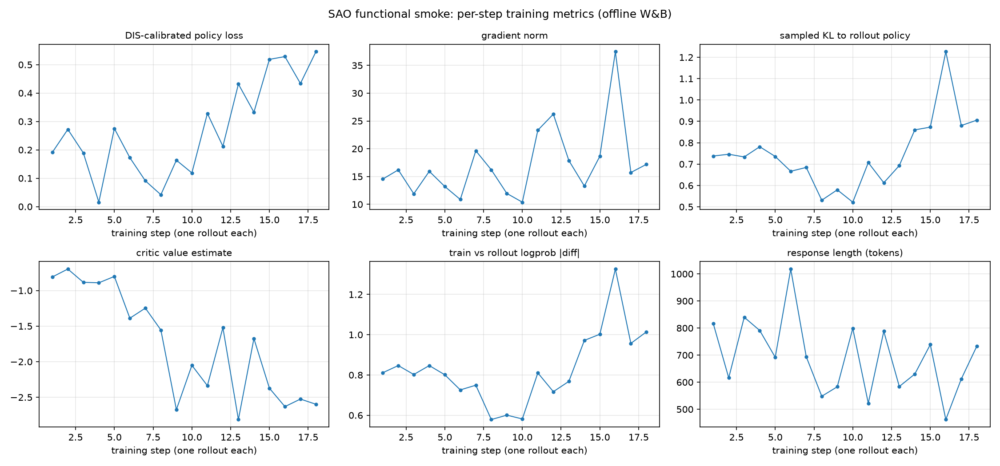

# SAO functional smoke result (2026-08-30)

One full run of the committed smoke: three IMOAnswerBench problems, six scored
rollouts each, on the `serve.yaml` in this directory. The acceptance criterion
for this smoke is that the async single-rollout path holds end to end: every
scored rollout becomes its own committed training step, with no stale drops
and readable runtime metrics.

Observed: **18/18 rollouts committed as training steps, 0 dropped**, one HF
checkpoint and one weight publish per step.

## What the numbers are

- `scores.csv` — all 18 rollouts with the extracted `\boxed{}` answer and its
  binary score. Every score is 0.0: Qwen2.5-1.5B-Instruct does not solve these
  three competition problems at 2048 generation tokens. That is expected; this
  smoke exercises the training path, it is not a convergence benchmark (see
  the example README).
- `training_history.csv` — the 18 committed steps with their `train/*`,
  `rollout/*`, and `perf/*` metrics, one row per step, exported from the
  offline W&B run file.
- `training_curves.png` — six of those metrics over the 18 steps.

The curves read coherently for an all-zero-reward stream: the critic's value
estimate declines toward the observed returns, and the sampled KL to the
rollout policy grows as the serving weights move away from the versions that
produced the queued rollouts — the gap the DIS ratio calibrates.

## Reproducing

Run the example as documented in its README (`./run.sh`). Two deviations from
the committed defaults were used to record this result:

- `observability.wandb` set to `enabled: true, mode: offline` — offline mode needs
  no W&B account; the run file lands under `work/wandb`.
- The stack ran inside the `docker/Dockerfile.reef` image with this repository
  mounted, instead of a host install of the training dependencies.

Training all 18 steps takes a while after `run.py` prints its last reward:
rollouts arrive faster than one-rollout training steps, so the queue drains in
the background. `work/checkpoints/hf/` shows one entry per committed step.

## Config fixes this run surfaced

The committed `serve.yaml` gained two changes, both required to run at all:

- The Megatron architecture flags that Reef does not derive from the HF config
  (`--padded-vocab-size`, rope, SwiGLU, RMSNorm, and Qwen2.5's QKV bias).
  Without them the driver builds a mismatched model and fails at weight load.
- `max_staleness: 18`. With the default `0`, every rollout that arrives while
  an earlier step is still training is dropped as stale — this stream then
  trains once and discards the other 17 reports. SAO's DIS ratio exists
  to calibrate that staleness, so the smoke admits every rollout it produces.
