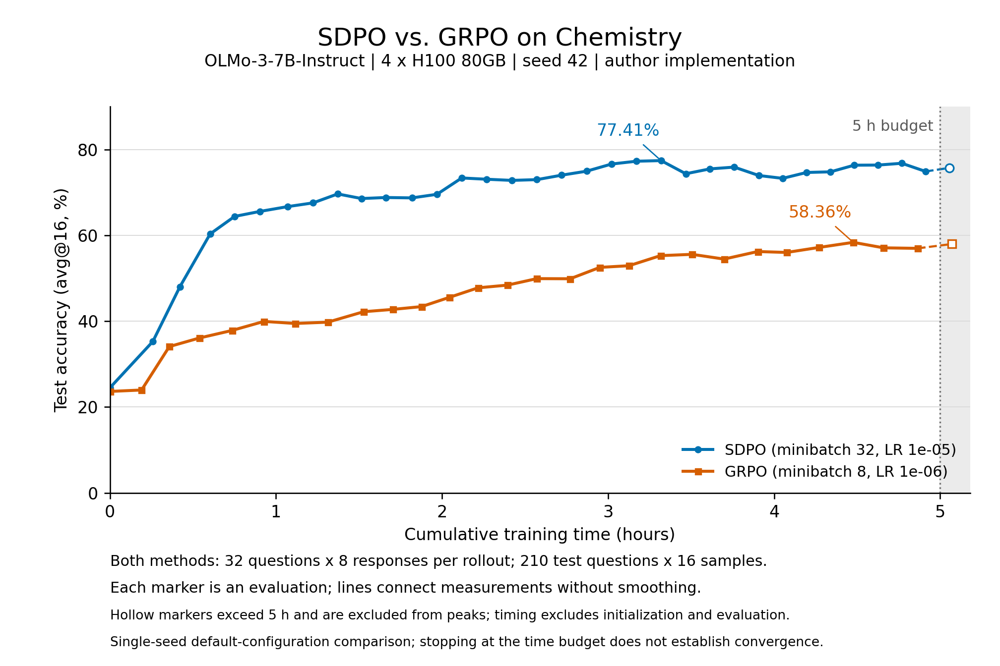

# SDPO paper reproduction

This directory pins the reference for [Reef #502](https://github.com/Human-Agent-Society/reef/issues/502).
It starts with Section 3: Chemistry / OLMo-3-7B-Instruct, followed by
ToolAlpaca / Qwen3-8B. Run the author's baseline before comparing Reef curves.
A numerical check or an infrastructure probe is not a reproduced learning curve.

## Pinned reference check

In a Reef environment with torch installed:

```bash
git clone https://github.com/lasgroup/SDPO.git /tmp/sdpo-reference
git -C /tmp/sdpo-reference checkout 7c457fc1b1f636ae794eb0362ba37d4743b06fbc
python recipes/sdpo/examples/paper/check_reference.py \
  --reference /tmp/sdpo-reference --device cpu \
  --output /tmp/sdpo-reference-parity.json
```

The check executes the author's actual loss function from the pinned, unmodified
file. It compares values and gradients in float32/float64, forward/reverse KL
and JSD, K=20/100, unequal response masks, mixed active rows, and empty targets.
Use `--device cuda` for the same comparison on a GPU. The JSON records the source
hash, torch version, and every observed numerical error.

## Run one reference experiment

Use the author's supported verl/vLLM environment and a local snapshot of
`allenai/Olmo-3-7B-Instruct` downloaded at a recorded Hugging Face revision.
The default budget is two training steps, explicitly marked as a smoke run:

```bash
python recipes/sdpo/examples/paper/run_reference.py \
  --reference /tmp/sdpo-reference \
  --model-path /models/Olmo-3-7B-Instruct --model-revision YOUR_SNAPSHOT_SHA \
  --dataset chemistry --method sdpo --seed 42 --gpus 4 \
  --output /tmp/chemistry-sdpo-seed42-smoke
```

Add `--dry-run` to write the command and manifest without loading the model.
Use a new output directory each time. For a paper-style time budget use
`--steps 0 --training-hours 5 --evaluate-first`. The initial avg@16 evaluation records the untrained model. The launcher totals
the author's `timing_s/step`
(which excludes initialization and validation) and stops the process group after
the first scheduled validation beyond five hours. The checkout stays unmodified.
Report the highest avg@16 at or below each 1h/5h boundary; the final validation
beyond the boundary is ineligible. `--steps 0` alone retains the author's
30-epoch upper limit; that is not the paper's comparison budget. `--method grpo --minibatch 32 --learning-rate 1e-5` selects a
matched on-policy GRPO comparator. Table 13's default off-policy GRPO uses
`--method grpo --minibatch 8 --learning-rate 1e-6`; keep these comparisons
separately labeled. The author sweeps both minibatches and both learning rates. The launcher records the dataset hashes,
seed, model revision, resolved Hydra configuration and training log. It preserves
the author's preprocessing and scoring functions.

## Check Reef's training cycle

In a supported four-GPU Reef environment, download `Qwen/Qwen3-0.6B` at a fixed
revision to `/tmp/models/Qwen3-0.6B`, then run from the repository root:

```bash
bash recipes/sdpo/examples/paper/run.sh
```

`smoke.yaml` uses fresh state under `/tmp/reef-sdpo-smoke`; do not reuse that
state for another smoke run. `harness/smoke.py` is a direct
`reef_client` campaign, so this smoke test does not require Harbor or
reef-eval. It performs two synchronous grids (2 questions × 2 attempts), supplies
formatting feedback, and waits for both weight releases. Results record receipts,
scores, sampling time and training time. This small synthetic test uses a different
model and budget from the paper and must never be reported as a paper result.

## Reference experiment contract

Resolve these settings from `experiments/generalization/run_sdpo_all.sh`,
`verl/trainer/config/sdpo.yaml`, `user.yaml`, and `actor/actor.yaml` at the pin:

| Setting | Section 3 |
| --- | --- |
| Models | `allenai/Olmo-3-7B-Instruct`, `Qwen/Qwen3-8B` |
| Training batch | 32 prompts × 8 sampled responses |
| Training sampling | temperature 1; thinking disabled |
| Prompt / response limits | 2048 / 8192 tokens |
| Teacher prompt limit | 10240, truncate right |
| Teacher | EMA, update rate 0.05 |
| Divergence | JSD, alpha 0.5; student top-100 plus tail |
| IS correction | token, cap 2 |
| Effective reduction | token mean per one-sample microbatch, then mean over all rollouts (inactive rows count) |
| Successful demo | first successful sibling; exclude self; remove thinking |
| Success threshold | 0.5 (binary task rewards) |
| Environment feedback | disabled in the generalization sweep |
| Optimizer | AdamW, LR 1e-5, weight decay 0.01, clip 1, warmup 10 |
| Validation | every 5 steps; avg@16, temperature 0.6, top-p 0.95 |
| Paper reporting budget | highest avg@16 within 1h / 5h training time, excluding initialization and validation |
| Author's epoch ceiling | 30; not the paper's reporting budget |

The generalization sweep overrides some actor YAML defaults. In particular,
using the dataclass's prompt whitespace or success/feedback defaults does not
reproduce the resolved experiment. Reef uses the YAML prompt strings verbatim.

The pinned Chemistry files contain 1890 train and 210 test examples. SHA-256:

- `datasets/sciknoweval/chemistry/train.json`: `dc841dc92a16a6af3944336ecd887e80907bc9244f2bd51cd2e3869959a84029`
- `datasets/sciknoweval/chemistry/test.json`: `772adb9f2bdb1bbc2a542f350b55a1b23091fa98e793f5e24c5dba410ce299bf`

[Table 3 of the paper](https://arxiv.org/html/2601.20802v1#S3) reports 1h/5h
training budgets on four GH200s (about six hours including initialization and
validation). Report H100 results with their own hardware and timing; do not
interpret equal wall time across different GPUs as equal compute. Also retain
step/token counts for comparisons with Reef.

Preserve the fixed split and author's prompt/scoring functions. Test examples
never become training reports; a ground-truth answer is used by the scorer,
not inserted as a teacher demonstration. Run seeds 42, 43, and 44 independently,
record model revision, resolved config, prompt order, successful-target fraction,
completion tokens, peak VRAM, wall time, and eval accuracy at each checkpoint.
Report each seed and mean/std; retain an untrained-model evaluation and matched
GRPO comparison. Any shortened smoke run must be labeled separately.

## Hardware and current limits

The paper uses GH200 hardware. H100 and GB200 are useful reproduction targets,
but wall-clock comparisons across them are not equivalent. Keep sampling,
optimizer batch size and evaluation budget constant when changing GPU count;
use extra devices for independent seeds/comparators after measuring throughput.

Reef's published Slime image is x86; GB200 hosts use ARM. A CUDA/BF16 probe alone
does not validate the Megatron/SGLang stack. First validate one complete
rollout → report → teacher pass → update → weight publication cycle.

The current recipe supports one update per grid and context parallelism 1.
Its EMA state is not persisted by the shared backend. Section 4 sequential
minibatches and exact training resume require further work. The two-step GPU smoke test below establishes the small-model training path;
full paper-result parity still requires the benchmark runs and comparisons.

## Recorded GPU smoke test

On 2026-09-24, four H100 80GB GPUs completed two synchronous updates with
Qwen3-0.6B and published new live weights after each update. The
[smoke record](results/2026-09-24/qualification.json) includes the model
revision, runtime pins, timings and numerical checks. The worker ran the
recipe as first submitted in pull request #608, on the base commit the record names.

The 24 CUDA loss/gradient comparisons against the pinned author's functions
passed (maximum gradient error 3.21e-9). The worker's 31 SDPO tests also passed.
The synthetic updates had finite, nonzero loss and gradients; all task scores
were zero and formatting feedback supplied the teacher targets. These results
check the training integration, not benchmark accuracy or paper reproduction.

The [author-reference smoke](results/2026-09-24/author-reference-smoke.json)
also completed two OLMo-3-7B-Instruct updates on four H100s with the complete
32×8 sampling batch and 210×16 final validation. Training took 420.3 seconds;
validation took 510.7 seconds. Its final avg@16 was 0.24970. There was no
untrained evaluation in this short smoke run, so it does not measure an
accuracy improvement or reproduce the paper's 1h/5h results.

## Chemistry reference result, seed 42

The [completed reference result](results/2026-09-24/author-reference-chemistry-seed42.json)
records the pinned author's OLMo-3-7B-Instruct implementation on four H100 80GB
GPUs. Both methods completed a five-hour pure-training budget with an initial
210×16 evaluation and further evaluations every five steps.

| Method | Initial avg@16 | Best within 1h | Best within 5h |
| --- | ---: | ---: | ---: |
| SDPO, minibatch 32, LR 1e-5 | 24.49% | 65.57% | 77.41% |
| Default GRPO, minibatch 8, LR 1e-6 | 23.63% | 39.94% | 58.36% |



The figure plots every recorded test evaluation against cumulative training time,
without smoothing. Hollow markers fall after the five-hour budget and are excluded
from the selected peaks. GRPO fluctuates around 57–58% near the end; both methods
stopped because of the time budget, so these curves do not establish convergence.
The [SVG figure](results/2026-09-24/chemistry-seed42-learning-curves.svg) preserves
vector graphics and selectable text. Recreate both formats from the checked-in JSON:

```bash
uv run --script recipes/sdpo/examples/paper/results/2026-09-24/plot_chemistry.py
```

The script pins Matplotlib separately from the training environment. The per-rollout
sampling batch is identical: 32 questions × 8 responses. The minibatch values denote
question-equivalent batch sizes: SDPO uses 32 (256 responses per optimizer update),
while default GRPO uses 8 (64 responses per update, four updates per rollout).
These settings match [Tables 12 and 13 in Appendix E.2](https://arxiv.org/html/2601.20802v1)
and the pinned author's `sdpo.yaml` / `baseline_grpo.yaml`. The paper also reports
on-policy GRPO with minibatch 32 and LR 1e-5; that additional comparator has not run.

The five-hour difference is 19.05 percentage points for this seed and these
configurations. This uses the default GRPO comparator, not a matched-learning-rate
or matched-minibatch ablation. The initial sampled evaluations differ and are
retained in the record. A single seed does not establish multi-seed uncertainty.

SDPO finished at step 165 after 18201.8 training seconds; GRPO finished at step
135 after 18255.5 seconds. Both stopped after the first scheduled evaluation
past the budget. Those last evaluations are excluded from the reported five-hour
scores. The record retains every evaluation with its cumulative training time,
sampled token counts, and hashes of the source logs and resolved configurations.

These are author-implementation reference curves, not Reef 7B benchmark curves.
The H100 hardware and runtime differ from the paper's GH200 setup. Additional
seeds, ToolAlpaca/Qwen3, and full benchmark training through Reef remain pending.
