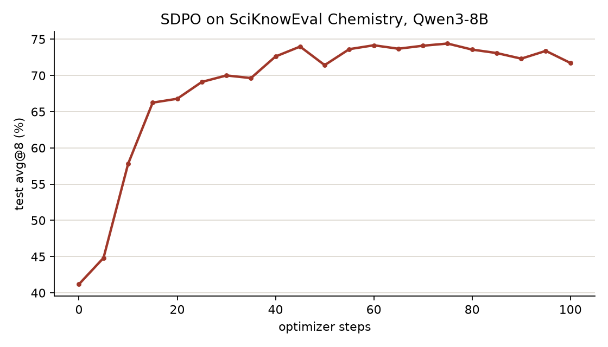

# SDPO on SciKnowEval Chemistry

This example trains Qwen3-8B on the Chemistry split of SciKnowEval with the
`sdpo` recipe (`recipes/sdpo/`). Each step samples 32 questions eight times
through Reef and scores every attempt. An attempt is distilled toward a
teacher that read a correct attempt at the same question. Every five steps
the served model is scored on the test split and that series is the learning
curve.

The data, the prompts, the scoring rule and the training settings come from
the reference implementation ([lasgroup/SDPO](https://github.com/lasgroup/SDPO)
at `7c457fc1b1f6`), which the task image clones.

```text
run.sh                          starts the Reef stack and runs the episode
run.py                          runs the Harbor task under the harness through reef-eval
harness/agent.py                runs the stage in the task container
harbor/chemistry/
  instruction.md                what the task trains
  task.toml                     timeouts and resource limits
  environment/
    Dockerfile                  clones the reference at its pin and installs reef-client
    docker-compose.yaml         names the host for the task container
    chemistry.py                the split, the prompts, the scorer and the Reef calls
    stage.py                    the runner: samples each grid, reports it, waits, evaluates
  tests/grade.py                the verifier: the last test score from the runner's curve
serve.yaml                      the training stack: Qwen3-8B on four GPUs
results/                        the learning curve of the recorded run
```

## The protocol

The split has 1890 training questions and 210 test questions. A question
has four options and a system prompt that asks for the answer letter inside
`<answer>` tags. An attempt is correct when the letter in its last
`<answer>` tags is the dataset's.

A step samples 32 questions eight times each at temperature 1 and takes one
optimizer step on the grid at learning rate 1e-5. The teacher reads the
question with the first correct attempt by another rollout appended and
scores the attempt's own tokens. An attempt whose question no other rollout
got right stays in the step with weight 0. The teacher is a copy of the
weights that moves 5% toward the policy after every step. The loss is the
Jensen-Shannon divergence over the student's top 100 tokens plus one bucket
for the rest of the vocabulary, with per-token importance weights capped at
2. Thinking is off.

The test split is scored every five steps at temperature 0.6 with eight
samples per question. Evaluation samples are never reported, so they never
train.

## Setup (once)

The training stack needs the GPU environment described in
[Evolve your model](../../../../docs/user-guide/evolve-your-model.rst). The
task container needs Docker. On the host:

```bash
pip install uv
hf download Qwen/Qwen3-8B --local-dir ~/models/Qwen3-8B
```

## Run

```bash
cd recipes/sdpo/examples/sciknoweval
./run.sh
```

`run.sh` starts the stack from `serve.yaml`, waits for it and runs the
episode. The run's state goes to `work/`.

## Results



One run of 100 steps with seed 42. The actor and the rollout engines ran on
separate GPUs.

Test accuracy goes from 41.2% to 66.2% in 15 steps and to 74.4% at step 75.
It stays between 72% and 74% from step 40 on and ends at 71.7%.

The rollouts stay diverse and the answer format holds through the run. A
question seen a second time is answered as well as the rest of the grid, so
the gain is not memorization. Responses shorten from 471 to 216 tokens on the
test split, and the model answers A less often than the split does.
