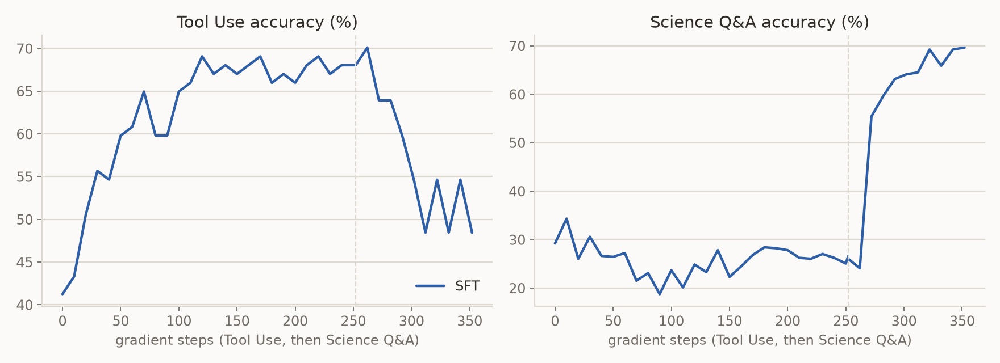

# SFT on a skill stream

This example runs the sequential experiment of
[Self-Distillation Enables Continual Learning](https://arxiv.org/abs/2601.19897)
(Figure 3) under supervised fine-tuning: one model learns a stream of skills
in turn, and each skill's test accuracy is followed through the whole stream,
so the score on a skill after the next skill's training is the forgetting.
The stream here is Tool Use, then Science Q&A, the first two of the paper's
three (the Medical split is not published), trained with the `sft` recipe
(`recipes/sft/`) on the datasets' demonstrations. It is the control arm of
the paper's comparison: the self-distillation recipes of
[#502](https://github.com/Human-Agent-Society/reef/issues/502) run the same
stream on the same reports, and their examples draw this arm beside their
own. Every stage runs as a
[reef-eval](https://github.com/Human-Agent-Society/reef-eval) episode: a Harbor
task whose judge scores the served model on both skills, so the curves are
the Lab store's trace rows.

The [`sft` recipe page](../../../../docs/user-guide/recipes/sft.rst) documents
the recipe; [Evolve your model](../../../../docs/user-guide/evolve-your-model.rst)
walks through the training stack. This README records the protocol, its
distance from the paper's, and the numbers.

```text
run.py             the stream: per stage, the Reef stack from the previous stage's weights, then lab.run
harness/agent.py      the Harbor agent: runs the stage runner in the task container with the host's SKILLS_* settings
harbor/tooluse/       the Tool Use stage: ToolAlpaca's training split through Reef, the reference's regex scorer
harbor/science/       the Science Q&A stage: the Chemistry L-3 split through Reef, exact match on the answer tag
  environment/
    skills.py         the two skills: the reference datasets, their scorers, the Reef calls (shared by both tasks)
    stage.py          the stage runner: 32 prompts, 32 samples, 32 reports, one step, wait for the release, repeat
    score.py          the judge's rule: both skills' test accuracy of the served model, this task's as the reward
    judge_server.py   reef-eval's template judge, recording the scores and reporting the last submission
  tests/grade.py      the verifier: the judge's final result as the reward, its score log as the trace
serve.yaml            the stack config: full fine-tuning with the sft recipe, the reference's Figure 3 settings
docker-compose.yaml   the stack in the reef image: four GPUs, the engines colocated with the actor
plot.py               the curves from the Lab store: both skills' accuracy against gradient steps
run.sh                checks the setup, mints the token, runs run.py in an ephemeral uv environment
results/              the recorded runs
```

## The protocol

The reference implementation ([idanshen/Self-Distillation](https://github.com/idanshen/Self-Distillation)
at `d77573212fa0`) ships both splits under `data/`. Tool Use is ToolAlpaca:
4046 training prompts, each a tool's documentation and a user request in the
ReAct format, with the dataset's golden response as the demonstration; 97
test prompts scored by `eval_tooluse.py` (the multiset of `Action:` names and
the merged `Action Input:` JSON must both equal the golden API call). Science
Q&A is the Chemistry L-3 subset of SciKnowEval: 2674 training prompts, each a
system message fixing the `<reasoning>`/`<answer>` format and a four-option
question, with GPT-4o's response as the demonstration; 507 test prompts
scored by `eval_science.py` (exact match of the text inside the last
`<answer>` tag). Both scorers decode greedily, Tool Use in a 1024-token
window and Science Q&A in 2048.

The paper's Figure 3 trains one model through the skills in sequence, each
skill a single-task run started from the previous one's weights, and its SFT
arm trains on the demonstrations with the settings the authors gave for these
runs (issue 9 of the reference): learning rate 1e-5 with a cosine schedule
and 10 warmup steps, 32 prompts per optimizer step for two epochs.

## Setup (once)

The training stack needs the GPU environment described in
[Evolve your model](../../../../docs/user-guide/evolve-your-model.rst), as the
`reef` image. On the host:

```bash
pip install uv
hf download Qwen/Qwen2.5-7B-Instruct --local-dir ~/models/Qwen2.5-7B-Instruct
```

## Run

```bash
cd recipes/sft/examples/skill_stream
./run.sh                                     # Tool Use (252 steps), then Science Q&A (167)
SKILLS_STEPS=2 ./run.sh --stream smoke       # a smoke run: two steps per stage
uv run --no-project --python 3.12 --with reef-eval --with matplotlib plot.py --lab work/lab --out results/figure3
```

`run.sh` reads `REEF_IMAGE` (default `reef`), `MODEL_DIR` (default
`~/models`), `RUN_DIR` (default `./work`: the Lab store and trials under
`lab/`, each stage's stack state and checkpoints under
`<stream>/sft/<task>/`). `run.py` takes `--stream` (the stream's name in the
Lab store; rows already recorded are skipped, so a crashed stream resumes
and a new name starts over) and `--seed`; `SKILLS_GPUS` (four
comma-separated ids, default `0,1,2,3`) and `SKILLS_PORT` (default `28902`)
place the stack, so a second stream on the other four GPUs of an eight-GPU
host runs beside it. The stage runner reads `SKILLS_EPOCHS`,
`SKILLS_PROMPTS_PER_STEP` (must equal the recipe's batch size in
`serve.yaml`), `SKILLS_MAX_TOKENS`, `SKILLS_EVAL_EVERY` and `SKILLS_STEPS`,
forwarded from the host by the harness.

## Results

One run of the stream (seed 42, `results/figure3/`: `accuracy.csv` holds
every judge score, `figure3.png` the curves). The Science Q&A stage was
stopped at step 108 of 167 to free its GPUs, so its curve ends at the
judge's score after step 100; the Tool Use stage ran to its end.

| after | Tool Use | Science Q&A |
|---|---|---|
| the base model (step 0) | 41.2% (40/97) | 29.2% (148/507) |
| Tool Use, 252 steps | 68.0% (66/97) | 26.6% (135/507) |
| Science Q&A, 100 of 167 steps | 48.5% (47/97) | 69.6% (353/507) |



Tool Use climbs from 41% to 68% over its stage and Science Q&A stays near
the base model's 29%. Twenty steps into the Science Q&A stage Science is at
55% and reaches 70% by step 100, while Tool Use falls from 68% to about
48% by step 60 and stays there: the forgetting the paper's Figure 3 shows
for SFT, on the same protocol. The SDFT arm of the same stream is recorded
in the `sdft` recipe's example.
